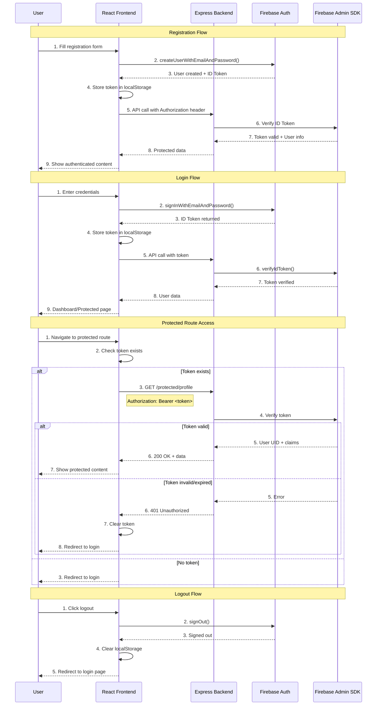
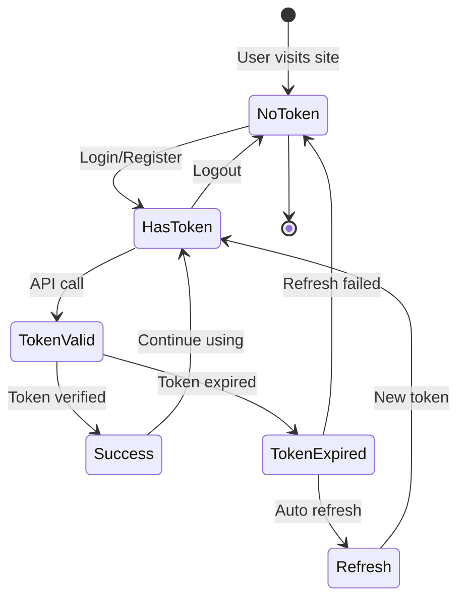

# Step 5: Implement Firebase Authentication

Integrate Firebase Authentication into the full-stack application. Update both frontend and backend to handle authentication flows with JWT token validation.

---

## Authentication Flow Overview

This section illustrates the complete authentication flow, showing the interaction between Frontend (React), Backend (Express API), and Firebase services.

### Complete Authentication Flow Diagram



### Token Lifecycle



### Component Architecture

**Frontend (React):**
- Firebase SDK for authentication
- React Context API for auth state management
- Protected routes with authentication guards
- Token storage in localStorage

**Backend (Express):**
- Firebase Admin SDK for token verification
- Authentication middleware
- Protected API endpoints
- User management endpoints

**Firebase Services:**
- User authentication and session management
- ID token generation and validation
- Automatic token refresh

---

## 5.1 Setup Firebase Project

### Create Firebase project

1. Go to Firebase Console
2. Click "Add project" or select existing project
3. Enable Google Analytics (optional)

### Enable Authentication methods

1. Navigate to **Build** → **Authentication** → **Get started**
2. Click **Sign-in method** tab
3. Enable desired providers (Email/Password, Google, etc.)

### Get Firebase configuration

1. Go to **Project settings** (gear icon) → **General**
2. Scroll to "Your apps" → Click **Web** icon (`</>`)
3. Register app and copy the `firebaseConfig` object

### Get Service Account for Backend

1. Go to **Project settings** → **Service accounts**
2. Click **Generate new private key**
3. Download the JSON file (e.g., `serviceAccountKey.json`)
4. Store securely and add to `.gitignore`

---

## 5.2 Update Frontend for Authentication

### Install Firebase SDK

```bash
cd web
npm install firebase
```

### Configure Firebase

Create `src/config/firebase.ts` with your Firebase config and initialize Firebase app.

### Implement Auth Context

Create authentication context and provider to manage auth state across the application.

**Key authentication methods:**

```typescript
// Register
const userCredential = await createUserWithEmailAndPassword(auth, email, password);
const idToken = await userCredential.user.getIdToken();

// Login
const userCredential = await signInWithEmailAndPassword(auth, email, password);
const idToken = await userCredential.user.getIdToken();

// Logout
await signOut(auth);
```

**Token storage:**

```typescript
// Store token
localStorage.setItem('firebaseToken', idToken);

// Retrieve token
const token = localStorage.getItem('firebaseToken');

// Clear token
localStorage.removeItem('firebaseToken');
```

### Create Auth Components

Implement Login and Register components with Firebase authentication methods (`signInWithEmailAndPassword`, `createUserWithEmailAndPassword`).

### Add Protected Routes

Update routing to protect routes that require authentication. Redirect unauthenticated users to login page.

**Key files:**
- `src/config/firebase.ts` - Firebase initialization
- `src/contexts/AuthContext.tsx` - Auth state management
- `src/components/Login.tsx` - Login form
- `src/components/Register.tsx` - Registration form

### Test locally

```bash
npm run dev
```

Verify registration and login work correctly.

---

## 5.3 Update Backend for Token Validation

### Install Firebase Admin SDK

```bash
cd api
npm install firebase-admin
```

### Initialize Firebase Admin

Create `src/config/firebase-admin.ts` and initialize with service account credentials.

> **Note:** For local development, load the service account JSON file directly. For production (AKS), use Kubernetes Secrets.

### Create Auth Middleware

Implement middleware to verify Firebase ID tokens on protected routes. Extract and validate tokens from the `Authorization` header.

### Protect API Routes

Apply auth middleware to routes that require authentication.

**Key files:**
- `src/config/firebaseConfig.ts` - Firebase Admin initialization
- `src/middleware/authMiddleware.ts` - Token verification middleware
- `src/routes/authRoutes.ts` - Auth endpoints
- `src/routes/protectedRoutes.ts` - Protected endpoints

### Test locally

```bash
npm run dev
```

Test protected endpoints with valid/invalid tokens using tools like Postman or `curl`:

```bash
# Without token (should fail)
curl http://localhost:3001/api/protected

# With token (should succeed)
curl -H "Authorization: Bearer <FIREBASE_ID_TOKEN>" http://localhost:3001/api/protected
```

---

## 5.4 Rebuild and Deploy Backend with Firebase

### Rebuild backend API

```bash
cd api
docker build -t mindx-api:v1.2.0 -t mindx-api:latest .
docker run -p 3001:3000 mindx-api:latest
```

### Tag and push to ACR

```bash
az acr login --name <ACR_NAME>

docker tag mindx-api:latest <ACR_NAME>.azurecr.io/mindx-api:latest
docker tag mindx-api:latest <ACR_NAME>.azurecr.io/mindx-api:v1.2.0

docker push <ACR_NAME>.azurecr.io/mindx-api:latest
docker push <ACR_NAME>.azurecr.io/mindx-api:v1.2.0

az acr repository show-tags --name <ACR_NAME> --repository mindx-api --output table
```

### Create Kubernetes Secret for Service Account

Create a secret to store the Firebase service account JSON:

```bash
kubectl create secret generic firebase-service-account \
  --from-file=serviceAccountKey.json=./serviceAccountKey.json \
  -n dev
```

Verify:

```bash
kubectl get secrets -n dev
kubectl describe secret firebase-service-account -n dev
```

### Update Backend Deployment

Update `api/k8s/deployment.yaml`:

1. Change image tag to `v1.2.0`
2. Add volume and volumeMount for the Firebase service account secret
3. Add environment variable `FIREBASE_SERVICE_ACCOUNT_PATH` pointing to the mounted secret file

Apply changes:

```bash
cd api
kubectl apply -f k8s/deployment.yaml -n dev
kubectl rollout status deployment/mindx-api -n dev
kubectl get pods -n dev
kubectl logs -f deployment/mindx-api -n dev
```

---

## 5.5 Rebuild and Deploy Frontend with Auth

### Rebuild frontend with Firebase config

```bash
cd web
docker build -t frontend-app:v2 .
docker run -p 3000:3000 frontend-app:v2
```

### Troubleshooting — Build-time Environment Variables

**Symptom:** Frontend build doesn't include Firebase config from `.env` file. App fails to initialize Firebase.

**Cause:** Vite's `VITE_*` environment variables are build-time only and must be available during `npm run build` inside the Docker container. The `.env` file is not copied into the container or is ignored during the build stage.

**Fix:** Use Docker build arguments to inject environment variables at build time.

Update `Dockerfile` to accept build args:

```dockerfile
ARG VITE_FIREBASE_API_KEY
ARG VITE_FIREBASE_AUTH_DOMAIN
ARG VITE_FIREBASE_PROJECT_ID
ARG VITE_FIREBASE_STORAGE_BUCKET
ARG VITE_FIREBASE_MESSAGING_SENDER_ID
ARG VITE_FIREBASE_APP_ID

ENV VITE_FIREBASE_API_KEY=$VITE_FIREBASE_API_KEY
ENV VITE_FIREBASE_AUTH_DOMAIN=$VITE_FIREBASE_AUTH_DOMAIN
ENV VITE_FIREBASE_PROJECT_ID=$VITE_FIREBASE_PROJECT_ID
ENV VITE_FIREBASE_STORAGE_BUCKET=$VITE_FIREBASE_STORAGE_BUCKET
ENV VITE_FIREBASE_MESSAGING_SENDER_ID=$VITE_FIREBASE_MESSAGING_SENDER_ID
ENV VITE_FIREBASE_APP_ID=$VITE_FIREBASE_APP_ID
```

Rebuild with build arguments:

```bash
docker build \
  --build-arg VITE_FIREBASE_API_KEY="your-api-key" \
  --build-arg VITE_FIREBASE_AUTH_DOMAIN="your-auth-domain" \
  --build-arg VITE_FIREBASE_PROJECT_ID="your-project-id" \
  --build-arg VITE_FIREBASE_STORAGE_BUCKET="your-storage-bucket" \
  --build-arg VITE_FIREBASE_MESSAGING_SENDER_ID="your-sender-id" \
  --build-arg VITE_FIREBASE_APP_ID="your-app-id" \
  -t frontend-app:v2 .
```

Or use a `.env` file with Docker:

```bash
docker build --env-file .env -t frontend-app:v2 .
```

> **Note:** For production, consider using Kubernetes ConfigMap or Secrets to manage these values, but remember that Vite variables are **build-time only** — they cannot be injected at runtime.

### Tag and push to ACR

```bash
az acr login --name <ACR_NAME>

docker tag frontend-app:v2 <ACR_NAME>.azurecr.io/frontend-app:v1.3.1
docker tag frontend-app:v2 <ACR_NAME>.azurecr.io/frontend-app:latest

docker push <ACR_NAME>.azurecr.io/frontend-app:v1.3.1
docker push <ACR_NAME>.azurecr.io/frontend-app:latest

az acr repository show-tags --name <ACR_NAME> --repository frontend-app --output table
```

### Update Frontend Deployment

Update `web/k8s/deployment.yaml` to use image tag `v2`, then apply:

```bash
cd web
kubectl apply -f k8s/deployment.yaml
kubectl rollout status deployment/frontend-deployment
kubectl get pods -l app=frontend
kubectl logs -f deployment/frontend-deployment
```

---

## 5.6 Verify Authentication Flow

### Get ingress IP

```bash
kubectl get ingress -A
```

### Test in browser

Navigate to `http://<EXTERNAL_IP>`:

1. **Register a new user** — verify user is created in Firebase Console
2. **Login with credentials** — verify token is stored in browser (localStorage/sessionStorage)
3. **Access protected routes** — verify authenticated users can access protected pages
4. **Check API calls** — open `F12` → `Network` tab → verify requests to `/api/*` include `Authorization: Bearer <token>` header
5. **Logout** — verify token is cleared and user is redirected to login

### Verify backend token validation

Check backend logs to confirm token validation:

```bash
kubectl logs -f deployment/mindx-api -n dev
```

### Test protected API endpoint

```bash
# Get a Firebase ID token from the browser (F12 → Application → Storage)
# or from the frontend console after login

curl -H "Authorization: Bearer <FIREBASE_ID_TOKEN>" http://<EXTERNAL_IP>/api/protected
```

### Complete Testing Checklist

#### 1. Test Registration
- Register new user with email and password
- Verify in Firebase Console: Authentication > Users > Should see new user

#### 2. Test Login
- Login with registered credentials
- Check browser DevTools > Application > Local Storage

#### 3. Test Logout
- Click logout button in frontend
- Verify localStorage is cleared
- Verify redirect to login page

---

## Security Considerations

### Frontend Security

1. **Token Storage:**
   - Currently stored in `localStorage` (vulnerable to XSS)
   - Alternative: `httpOnly` cookies (recommended for production)

2. **Token Exposure:**
   - Never log tokens to console
   - Clear tokens on logout
   - Handle expired tokens gracefully

3. **Protected Routes:**
   - Check auth state before rendering
   - Redirect unauthenticated users
   - Show loading states during verification

### Backend Security

1. **Token Verification:**
   - Always verify tokens on protected endpoints
   - Use Firebase Admin SDK for verification
   - Check token expiration

2. **CORS Configuration:**
   - Allow only trusted origins
   - Enable credentials for cookie-based auth
   - Validate request headers

3. **Environment Variables:**
   - Store service account JSON securely
   - Use Kubernetes Secrets in production
   - Never commit credentials to git

### Firebase Security

1. **Firebase Rules:**
   - Configure Firestore/Storage security rules
   - Implement proper read/write permissions
   - Use custom claims for role-based access

2. **API Key Security:**
   - Firebase API keys are safe to expose (domain-restricted)
   - Configure authorized domains in Firebase Console
   - Monitor usage for suspicious activity

---

## Common Issues & Solutions

### Issue 1: "Firebase: Error (auth/invalid-api-key)"

**Cause:** Firebase config not injected during build

**Solution:** Use Docker `--build-arg` flags (see section 5.5 troubleshooting)

### Issue 2: Backend returns 401 on valid token

**Cause:** Service account not loaded or incorrect path

**Solution:** 
- Verify `GOOGLE_APPLICATION_CREDENTIALS` environment variable
- Check volume mount in Kubernetes deployment
- Ensure secret exists: `kubectl get secret firebase-service-account -n dev`

### Issue 3: CORS errors on auth endpoints

**Cause:** Backend not allowing frontend origin

**Solution:** Update CORS config to include Cloudflare Tunnel URLs

### Issue 4: Token refresh fails

**Cause:** Firebase SDK automatically refreshes, but app doesn't handle it

**Solution:** Implement token refresh listener in AuthContext
