# Google Analytics Product Metrics Setup Guide (Low-Code)

> Read the official documentation at https://support.google.com/analytics/answer/9304153?hl=en#property and follow the instructions

---

## Part 1: Create Google Analytics Account

### Step 1: Create GA4 Property

1. Go to https://analytics.google.com/
2. Click **"Start measuring"** (or **"Admin"** if you already have an account)
3. **Account setup**:
   - **Account name**: MindX Training
   - Click **Next**

4. **Property setup**:
   - **Property name**: MindX Frontend App
   - **Reporting time zone**: (GMT+07:00) Vietnam Time
   - **Currency**: Vietnamese Dong (₫)
   - Click **Next**

5. **Business details**:
   - **Industry**: Technology
   - **Business size**: Small
   - Click **Next**

6. **Business objectives**:
   - Select **Examine user behavior**
   - Click **Create**

---

### Step 2: Create Web Data Stream

1. **Platform**: Select **Web**

2. **Set up web stream**:
   - **Website URL**: `https://exec-subject-wesley-make.trycloudflare.com`
   - **Stream name**: MindX Frontend Production
   - Click **Create stream**

3. Find your **Measurement ID**: `G-XXXXXXXXXX`

4. **Copy this Measurement ID** (example: `G-ABC123XYZ`)

5. Wait for the **Google Tag verification email**

6. Select **Verify**

7. **Copy the Google tag (gtag.js) code** from the email

---

## Part 2: Integrate with Frontend

### 1. Install Google Analytics Package

```bash
npm install react-ga4 --save
```

### 2. Add Google Tag to index.html

Paste the **Google tag (gtag.js)** code from the email into your `index.html` file.

### 3. Create Google Analytics Helper

Create a new file `src/utils/analytics.ts` with your analytics configuration code.

### 4. Update .env File

Add the Measurement ID to your `.env` file:

```env
VITE_GA_MEASUREMENT_ID=G-XXXXXXXXXX
```

### 5. Update App.tsx

Integrate Google Analytics initialization in your `App.tsx` component.

### 6. Track Events in Components

Add event tracking in:
- `AuthForm.tsx`
- `AuthContext.tsx`

### 7. Update Dockerfile

Add ARG and ENV for the Google Analytics Measurement ID:

```dockerfile
ARG VITE_GA_MEASUREMENT_ID
ENV VITE_GA_MEASUREMENT_ID=$VITE_GA_MEASUREMENT_ID
```

---

## Part 3: Build & Deploy

### 1. Build Docker Image

```bash
docker build \ 
--build-arg VITE_API_URL="$VITE_API_URL" \ 
--build-arg VITE_FIREBASE_API_KEY="$VITE_FIREBASE_API_KEY" \ 
--build-arg VITE_FIREBASE_AUTH_DOMAIN="$VITE_FIREBASE_AUTH_DOMAIN" \ 
--build-arg VITE_FIREBASE_PROJECT_ID="$VITE_FIREBASE_PROJECT_ID" \ 
--build-arg VITE_FIREBASE_STORAGE_BUCKET="$VITE_FIREBASE_STORAGE_BUCKET" \ 
--build-arg VITE_FIREBASE_MESSAGING_SENDER_ID="$VITE_FIREBASE_MESSAGING_SENDER_ID" \ 
--build-arg VITE_FIREBASE_APP_ID="$VITE_FIREBASE_APP_ID" \ 
--build-arg VITE_GA_MEASUREMENT_ID="$VITE_GA_MEASUREMENT_ID" \ 
-t <<ACR-NAME>>.azurecr.io/<<FE-NAME>>:v1.x.x .
```

### 2. Login to ACR (if not already logged in)

```bash
az acr login --name <<ACR-NAME>>
```

### 3. Push Docker Image

```bash
docker push <<ACR-NAME>>.azurecr.io/<<FE-NAME>>:v1.x.x
```

### 4. Update Image Version in deployment.yaml

Update the image tag in your `deployment.yaml` file to `v1.x.x`.

### 5. Apply Deployment

```bash
kubectl apply -f deployment.yaml
```

### 6. Check Rollout Status

```bash
kubectl rollout status deployment/frontend-deployment -n dev
```

### 7. View Logs

```bash
kubectl logs -f deployment/frontend-deployment -n dev --tail=50
```

---

## Part 4: Test Google Analytics

### Step 1: Generate Traffic

1. Open your browser and visit the frontend multiple times:
   ```
   https://exec-subject-wesley-make.trycloudflare.com/
   ```

2. **Perform various actions**:
   - Login/Logout multiple times
   - Click on various buttons
   - Navigate between different pages

### Step 2: View Real-time Reports

1. Go to https://analytics.google.com/

2. Select **Property**: MindX Frontend App

3. Navigate to: **Sidebar** → **Reports** → **Realtime**

4. You should see:
     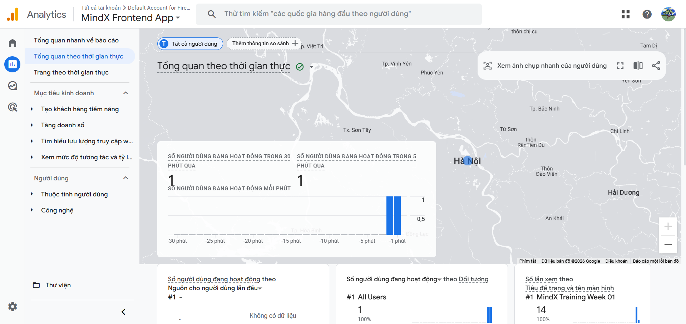
     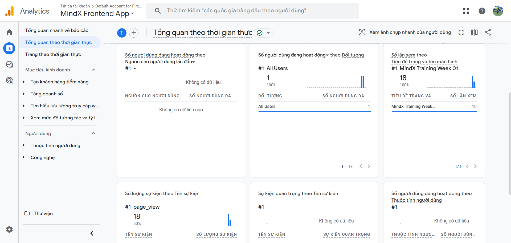
     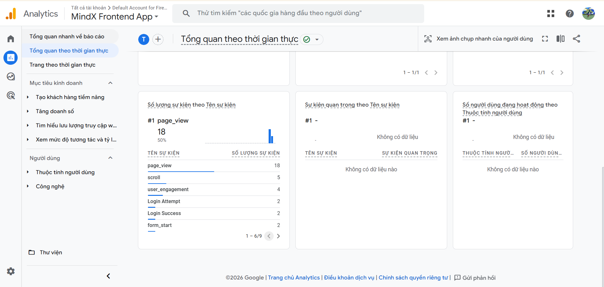
     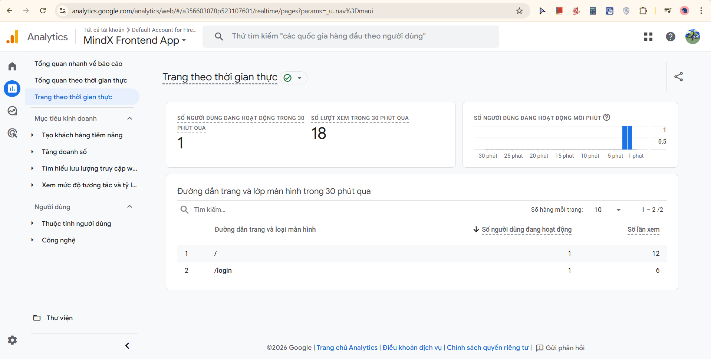
     
   - **Active users** currently on your site
   - **Page views** happening in real-time
   - **Events** being triggered
   - **User locations** and **devices**

---

##  Part 5: How to Access Google Analytics Dashboard & View Analytics Data

### Access Google Analytics (For Viewers/Reviewers)

1. Go to [Google Analytics](https://analytics.google.com)
2. Sign in with your **MindX company email** (mentor's email that was granted Viewer access)
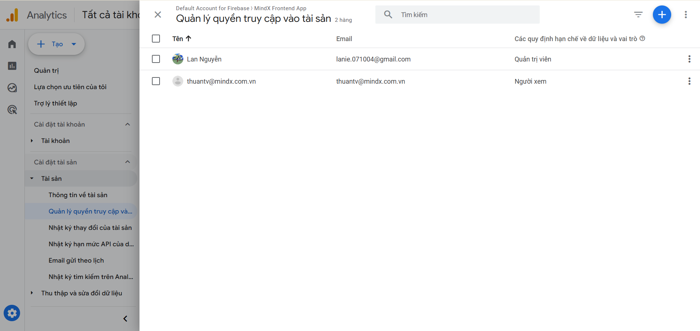
3. Click **MindX Training**
4. Select property: **MindX Frontend App**

### View Real-time Reports
**Sidebar** → **Reports** → **Realtime**
- See current active users
- Monitor events as they happen
 
 
 
 

### View User Reports
**Sidebar** → **Reports** → **User**
- **User attributes**: Demographics and technology
 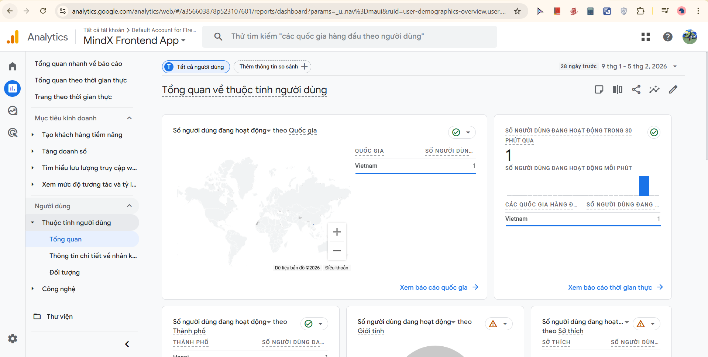
 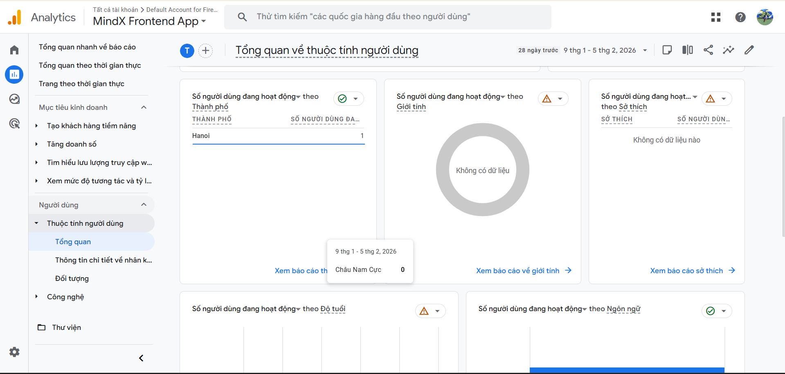
 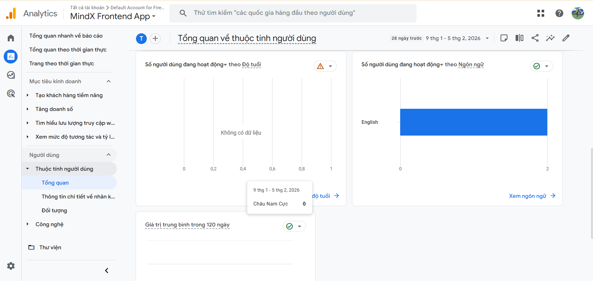
 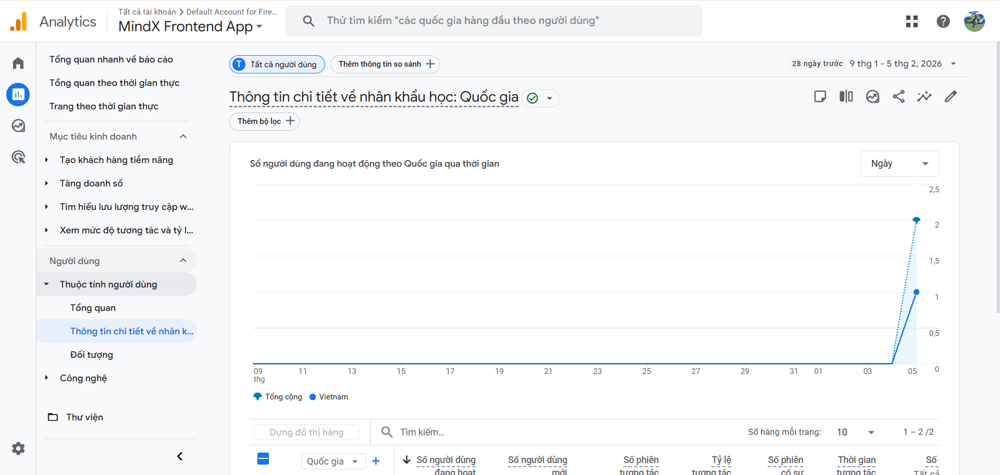
 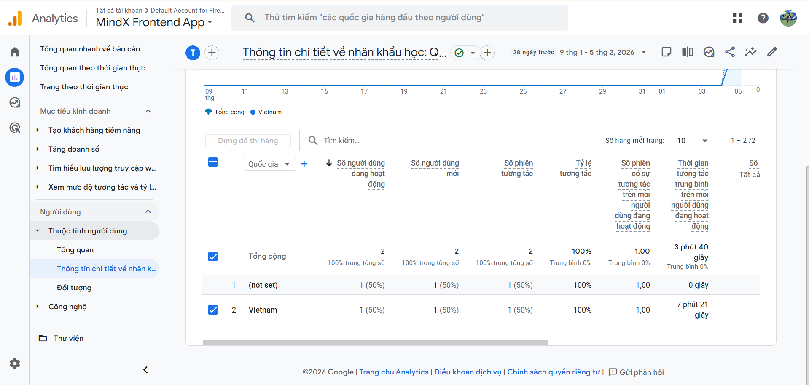
 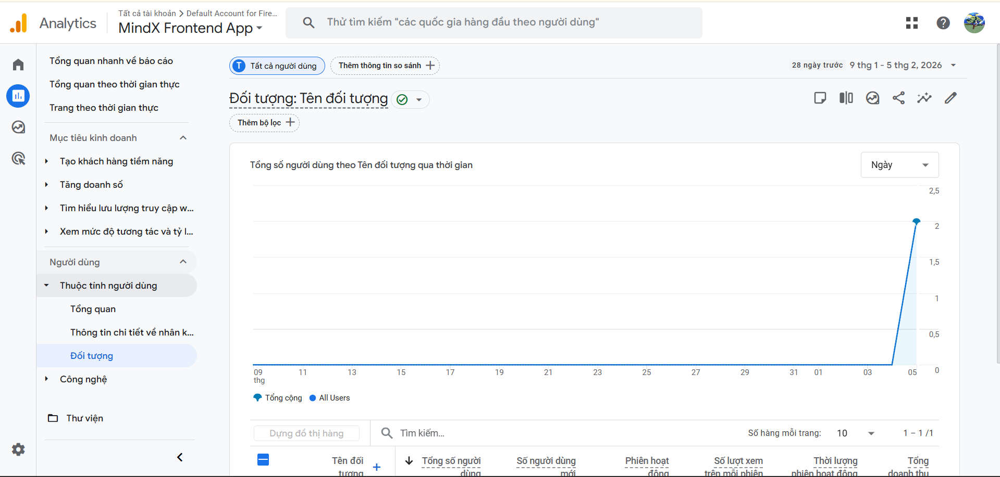
 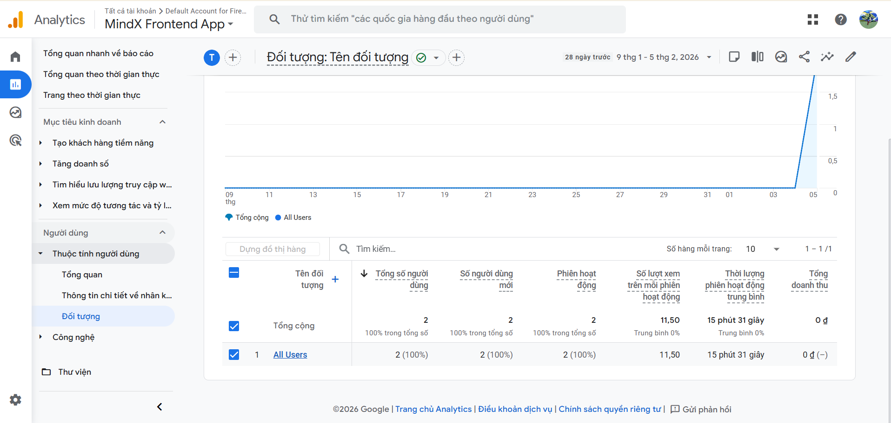

- **Technology**: Device and browser information
 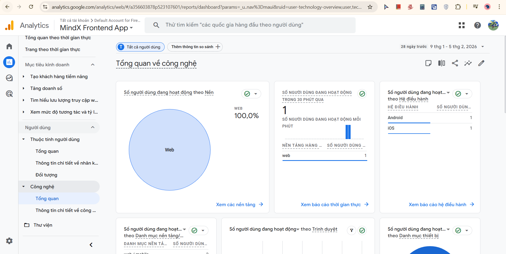
 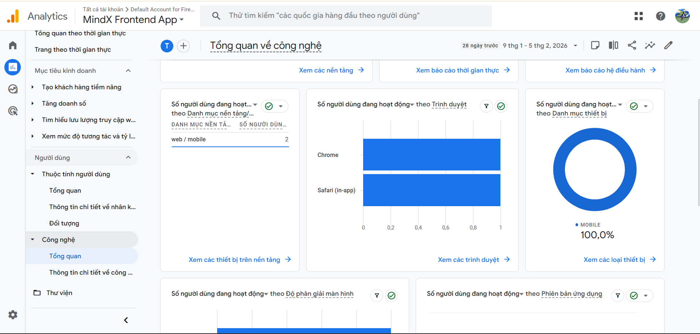
 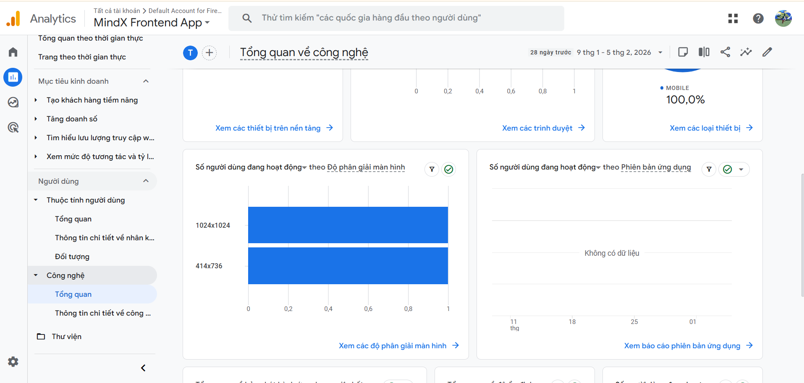
 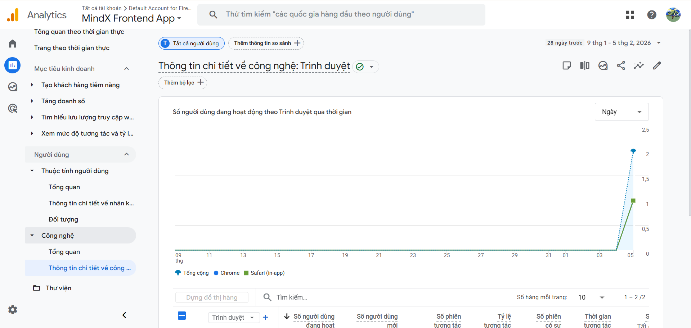
 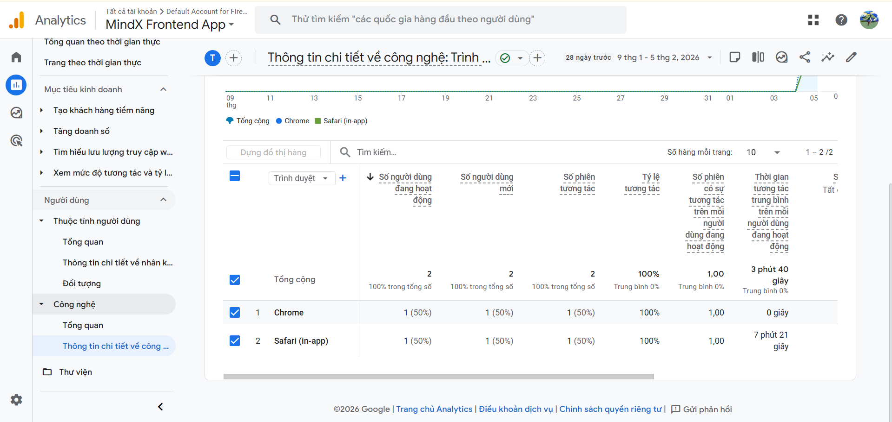

### View Library
**Sidebar** → **Library**: Access saved reports and custom dashboards
 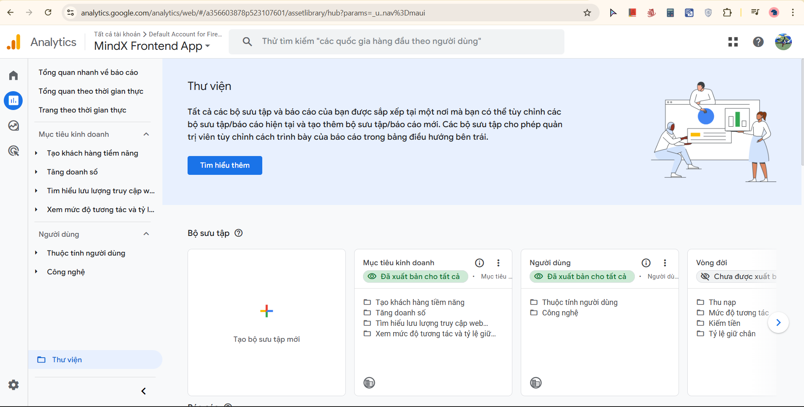

---

## Troubleshooting

### Google Analytics Not Receiving Data

1. **Check Measurement ID**:
   - Verify the `VITE_GA_MEASUREMENT_ID` is correct in `.env`
   - Ensure it matches the ID in Google Analytics

2. **Verify Google Tag Installation**:
   - Check that you're already done verifying Google Tag email
   - Check that gtag.js is properly loaded in `index.html`
   - Use browser DevTools → Network tab to confirm gtag requests

