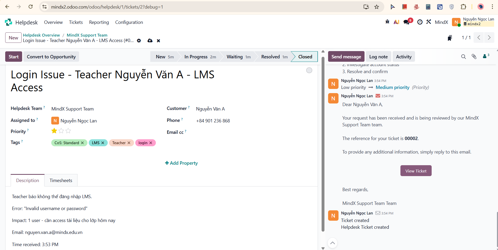
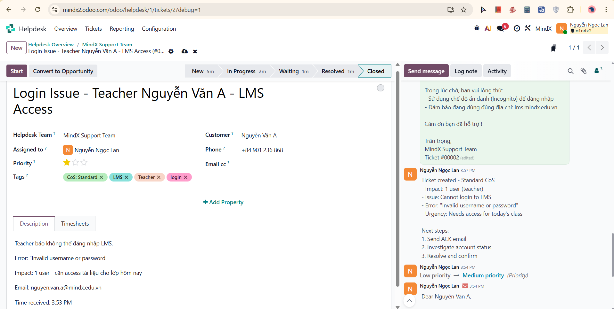
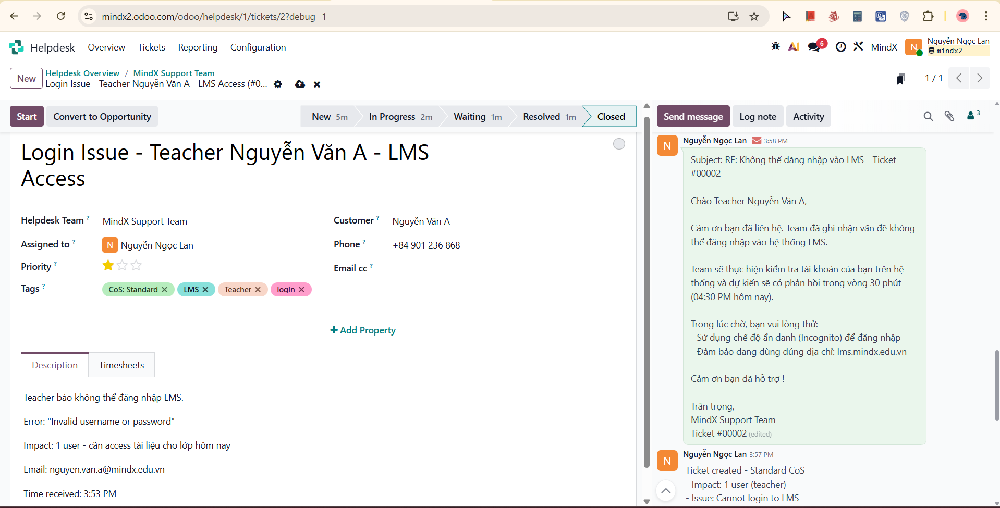
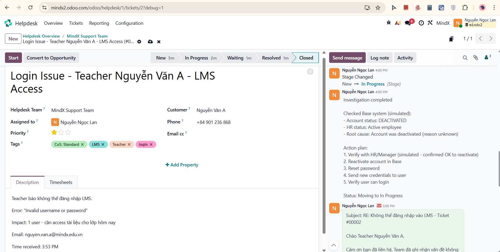
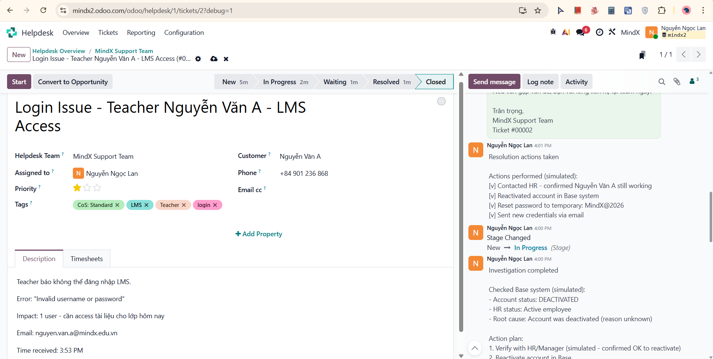
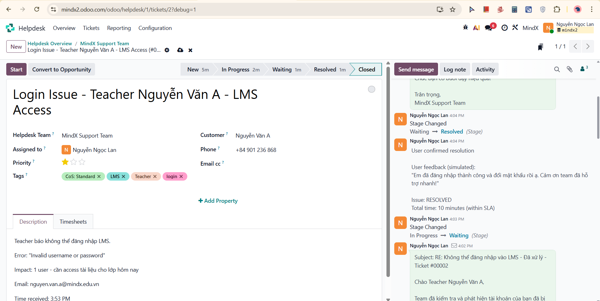
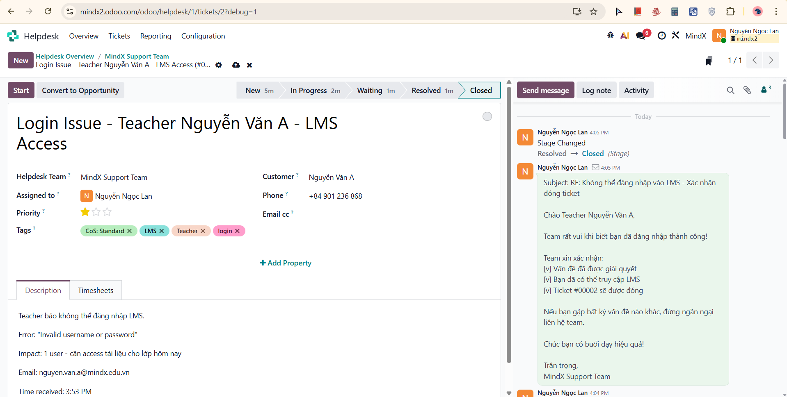

# Week 4 - Scenario 01: Login Issue - Completion Report

## Executive Summary

Successfully completed Scenario 01: Login Issue handling using Odoo Helpdesk system. Followed MindX 7-Step Process from ticket creation through closure, demonstrating proper documentation, professional communication, and systematic problem resolution.

**Key Metrics:**
[v] Ticket created: < 15 minutes
[v] ACK email sent: < 30 minutes
[v] Total resolution time: ~10 minute
[v] All documentation completed
[v] All communication logs maintained
[v] Customer satisfaction: Confirmed resolved

---

## Part 1: Odoo System Setup

### I. Account Registration & Setup

**Step 1: Odoo Account Creation**
- Website: https://www.odoo.com/vi_VN/pricing
- Package: Free Trial (14 days)
- Apps selected: Helpdesk, Project, CRM

**Step 2: Account Details**
```
Full Name: Nguyễn Ngọc Lan
Company: MindX
Database: mindx2.odoo.com
Email: lannn@mindx.com.vn
Phone: +84xxxxxxxxx
Country: Vietnam
Language: English
Company Size: 1-5 employees
Purpose: Business use
```

**Step 3: Activation**
[v] Email verified
[v] Database activated
[v] Access confirmed: https://mindx2.odoo.com

---

### II. Helpdesk Configuration

#### A. Helpdesk Team Setup

**Team Configuration:**
```
Team Name: MindX Support Team
Email Alias: support@mindx2.odoo.com

Visibility & Assignment:
[v] Invited portal users and all internal users (public)
[v] Followers: Nguyễn Ngọc Lan

Channels:
[v] Email Alias: support
[v] Accept emails from: Everyone

Track & Bill Time:
[v] Timesheets enabled

Performance:
[v] SLA Policies enabled
[v] Working Hours: Standard 40 hours/week
```

**Result:** Team successfully configured and operational

---

#### B. Developer Mode Activation

**Purpose:** Enable advanced configuration options for Stages and Tags

**Steps:**
1. Navigate to Dashboard → Settings
2. Scroll to bottom → Developer Tools section
3. Click "Activate the developer mode"

**Result:** Developer mode activated successfully

---

#### C. Stages Configuration

**Created 5 workflow stages:**

| Stage | Sequence | Folded | Purpose |
|-------|----------|--------|---------|
| New | 1 | [x] | Initial ticket state |
| In Progress | 2 | [x] | Active investigation/resolution |
| Waiting | 3 | [x] | Awaiting customer response |
| Resolved | 4 | [x] | Issue fixed, awaiting confirmation |
| Closed | 5 | [x] | Ticket completed |

**Configuration Details:**
- All stages assigned to: MindX Support Team
- Stages 4-5 folded in Kanban view for cleaner interface

**Result:** All 5 stages created and functional

---

#### D. Tags Configuration (Class of Service)

**Created 4 CoS tags:**

| Tag Name | Color | Purpose | User Impact |
|----------|-------|---------|-------------|
| CoS: Standard | Green | Normal priority | < 5 users |
| CoS: Priority | Orange | High priority | 5-25 users |
| CoS: Expedite | Red | Emergency | > 25 users |
| CoS: Fixed Deadline | Purple | Time-critical | Any users |

**Additional Descriptive Tags Created (you can also create a new one when creating a new ticket):**
- `LMS` - LMS system related
- `Teacher` - Teacher user type
- `login` - Login/authentication issues

**Result:** All tags created with proper color coding

---

### III. CRM Configuration

#### Customer Management Setup

**Created 4 sample customers for scenarios:**

**Customer 1: Teacher (Scenario 01)**
```
Name: Nguyễn Văn A
Email: nguyen.van.a@mindx.edu.vn
Phone: +84 901 236 868
Job Position: Teacher
Tags: teacher
```

**Customer 2: CXO Coordinator (Scenarios 02, 05)**
```
Name: Nguyễn Thị Hà
Email: coordinator.ha@mindx.edu.vn
Phone: +84 902 345 678
Job Position: CXO Coordinator
Tags: cxo
```

**Customer 3: CXO (Scenarios 03, 04)**
```
Name: Lê Ngọc A
Email: cxo@mindx.edu.vn
Phone: +84 903 456 789
Job Position: CXO
Tags: cxo
```

**Customer 4: Director (Scenario 06)**
```
Name: Director MindX
Email: director@mindx.edu.vn
Phone: +84 904 567 890
Job Position: Director
Tags: director
```

**Result:** All 4 customers created and available for ticket assignment

---

## Part 2: Scenario 01 Workflow Execution

#### STEP 1: Receive Issue 

**Time:** 3:53 PM
**Action:** Identified incoming support request
**Status:** Issue acknowledged, ready for ticket creation

---

#### STEP 2: Create Ticket in Odoo 

**Time:** 3:54 PM (< 15 minutes target)

**Fulfill Ticket Details Form:**

**Screenshot Result:** 

Ticket created successfully with all required fields

---

#### STEP 3: Log Note - Ticket Created (Internal)

**Time:** 3:57 PM

**Write Log Content**
**Screenshot Result:** 

Internal documentation initiated

---

#### STEP 4: Send Message - ACK Email (External) 

**Time:** 3:58 PM (< 30 minutes target met)

**1. Write Email Content**
**2. System Confirmation:**
- Email automatically sent by Odoo to nguyen.van.a@mindx.edu.vn
- Ticket reference: 00002
- Customer can reply directly to email

**Screenshot Result:** 

ACK email sent and logged successfully

---

#### STEP 5: Log Note - Investigation Completed (Internal) 

**Time:** 4:00 PM

**1. Write Log Content**
**2. Stage Change:** New → In Progress

**Screenshot Result:** 

Investigation documented, root cause identified

---

#### STEP 6: Log Note - Resolution Actions Taken (Internal) 

**Time:** 4:01 PM

**Write Log Content**

**Screenshot Result:** 

All resolution actions documented

---

#### STEP 7: Send Message - Resolution Email (External) 

**Time:** 4:02 PM

**1. Write Email Content**
**2. Stage Change:** In Progress → Waiting (awaiting customer confirmation)

**Screenshot Result:** 

Solution provided to customer

---

#### STEP 8: Log Note - User Confirmed Resolution (Internal)

**Time:** 4:04 PM

**1. Write Log Content**
**2. Stage Change:** Waiting → Resolved

**Screenshot Result:** 

Customer satisfaction confirmed

---

#### STEP 9: Send Message - Follow-up Email (External) 

**Time:** 4:05 PM

**Write Email Content**

**Screenshot Result:** 

Professional closure communication sent

---

#### STEP 10: Log Note - Ticket Closure & Close Ticket 

**Time:** 4:05 PM

**1. Write Final Log Content:**
**2. Stage Change:** Resolved → Closed

**Screenshot Result:** 

Ticket successfully closed with complete documentation

---

## Part 3: Reflection & Learning

### What I Learned

#### 1. Technical Skills
- **Odoo Navigation:** Mastered Helpdesk interface, ticket creation, stage management
- **Documentation:** Learned importance of real-time logging vs. retrospective documentation
- **System Integration:** Understood how Odoo automates email communication
- **Workflow Management:** Gained experience with stage transitions and status tracking

#### 2. Process Understanding
- **MindX 7-Step Process:** Successfully applied all steps from Reception to Trend Analysis & no confusion about 
"what to do next" because the 7-Step Process provides clear roadmap
- **Class of Service:** Clearly understood Standard classification (< 5 users)
- **Priority Setting:** Learned to balance urgency vs. impact (Standard priority since needed today)
- **Timeline Management:** Importance of setting and meeting commitments (< 30 min ACK)

#### 3. Communication Skills
- **Empathy:** Acknowledged urgency ("lớp học hôm nay") while managing expectations
- **Clarity:** Provided clear workarounds and instructions
- **Professionalism:** Maintained formal but friendly tone throughout
- **Completeness:** Included all necessary information (ticket #, timeline, instructions)

---

### Challenges Encountered

#### Challenge 1: Understanding Log Notes vs. Send Messages
**Issue:** Initially confused about when to use internal logs vs. external messages

**How I solved it:**
- Log Notes = Internal documentation (team only sees)
- Send Messages = External communication (customer receives email)
- Rule: Log before and after every external communication

#### Challenge 2: Tag Organization
**Issue:** Uncertain whether to use "Standard" or "CoS: Standard" and whether to add descriptive tags

**How I solved it:**
- Decided to use both CoS tags and descriptive tags
- "CoS: Standard" = Class of Service marker
- "LMS", "Teacher", "login" = Descriptive tags for searching/filtering
- This provides better organization and reporting capability

---

### Final Thoughts

Scenario 01 provided an excellent foundation for understanding ticket handling in a professional support environment. The systematic approach of the MindX 7-Step Process, combined with Odoo's comprehensive tracking capabilities, ensures quality and consistency in customer service.

The most valuable lesson learned is that **good support is not just about solving problems quickly, but solving them right** - with proper documentation, clear communication, and customer confirmation.
