# Week 4 - Scenario 02: Performance Problem - Completion Report

## Executive Summary

Successfully completed Scenario 02: LMS Performance Issue handling using Odoo Helpdesk system. Followed MindX 7-Step Process from ticket creation through closure, demonstrating proper classification, thorough investigation, appropriate escalation to Dev Team, and systematic communication throughout resolution.

**Key Metrics:**
[v] Ticket created: < 15 minutes
[v] ACK email sent: < 30 minutes
[v] Escalation to Dev Team: < 20 minutes after investigation
[v] Total resolution time: ~30 minutes (10:35 PM - 11:05 PM)
[v] All documentation completed
[v] All communication logs maintained
[v] Customer satisfaction: Confirmed resolved

---

## Part 1: Ticket Information

**Ticket:** #00003
**Title:** LMS Performance Issue - Class WEB101-HN-2024 (15 users affected)
**Customer:** Nguyen Thi Ha (CXO Coordinator)
**Tags:** CoS: Priority, LMS, performance, web101
**Priority:** High (2 stars)
**Time received:** 10:35 PM

---

## Part 2: Scenario 02 Workflow Execution

#### STEP 1: Receive & Classify Issue

**Time:** 10:35 PM
**Action:** Identified incoming urgent support request from CXO Coordinator

**Classification decision:**
- Users affected: 15 students + 1 CXO = Priority range (5-25 users)
- Blocking work: Yes (cannot submit assignments, class in progress)
- Class of Service: **Priority** (not Standard: >5 users; not Expedite: <25 users)

---

#### STEP 2: Create Ticket in Odoo

**Time:** 10:38 PM (< 10 minutes)

**Screenshot Result:**
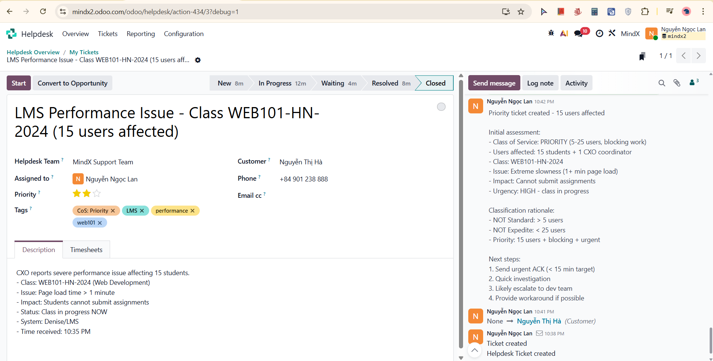
Ticket created with all required fields - title, customer, priority, tags, description

---

#### STEP 3: Log Note - Ticket Created & Initial Assessment (Internal)

**Time:** 10:42 PM

**Screenshot Result:**

Initial assessment logged with classification rationale (Priority CoS), users affected, urgency level, and planned next steps

---

#### STEP 4: Send Message - ACK Email (External)

**Time:** 10:44 PM (< 15 minutes target met)

**Screenshot Result:**
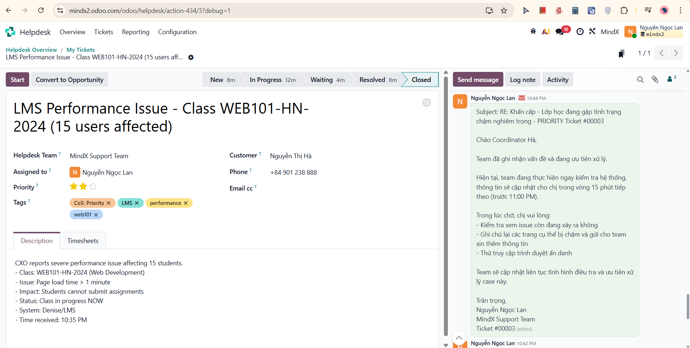
ACK email sent confirming receipt with Priority classification, 15-minute update commitment, and immediate workarounds provided (incognito mode, email submission alternative)

---

#### STEP 5: Log Note - ACK Confirmed & Investigation Started (Internal)

**Time:** 10:45 PM

**Screenshot Result:**
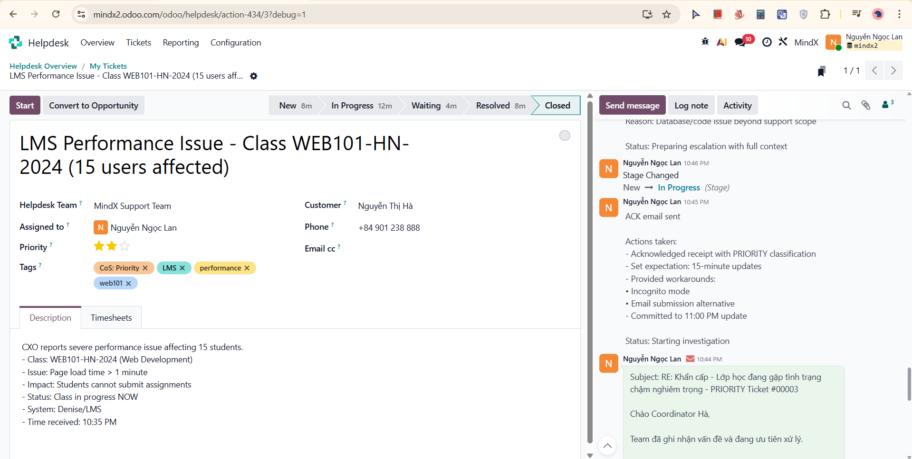
Logged ACK actions taken, workarounds provided, and status: Starting investigation. Stage changed: New → In Progress

---

#### STEP 6: Log Note - Investigation Completed (Internal)

**Time:** 10:50 PM

**Investigation findings (simulated):**
- Azure App Insights: Response time spike 2s → 35s starting at 2:00 PM
- Error rate: Normal → High (timeout errors)
- Database connection pool: 85% full (critical)
- Pattern: Only WEB101-HN-2024 affected, other classes normal
- Application logs: Multiple slow query warnings, database timeout errors, connection pool exhaustion

**Root cause hypothesis:** Database query optimization issue / Large dataset for this class

**Decision:** Escalate to Dev Team (database/code issue beyond support scope)

**Screenshot Result:**
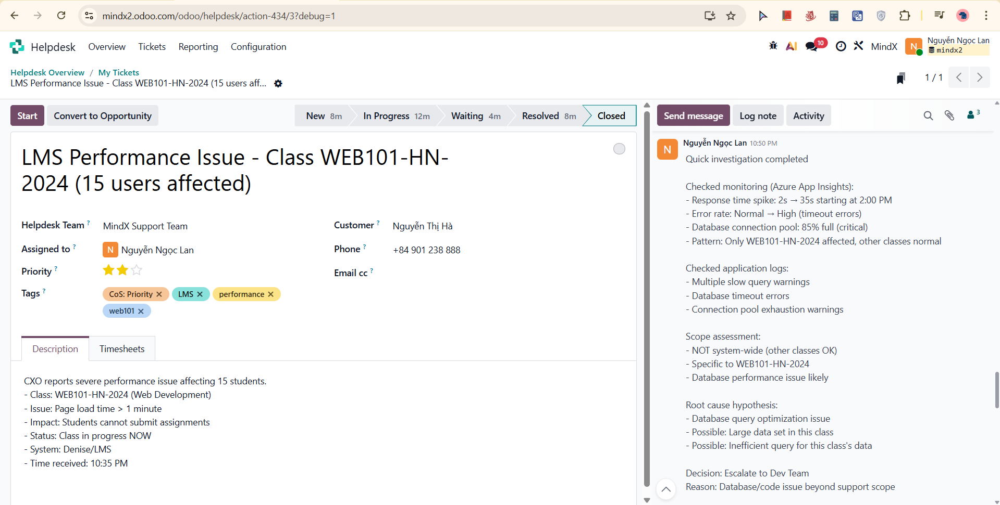
Full investigation findings documented including monitoring results, log analysis, scope assessment, and escalation decision rationale

---

#### STEP 7: Log Note - Escalation to Dev Team (Internal)

**Time:** 10:54 PM

**Screenshot Result:**
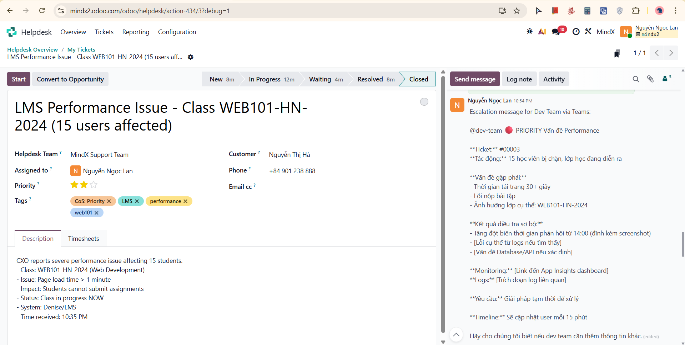
Escalation message to Dev Team via Teams documented, including ticket number, impact, investigation findings, monitoring links, and 15-minute update commitment to user

---

#### STEP 8: Send Message - Investigation Update & Escalation Email (External)

**Time:** 10:57 PM

**Screenshot Result:**
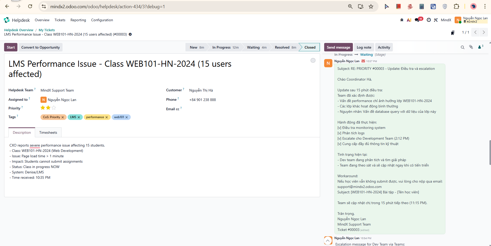
Update email sent to Coordinator Ha with investigation findings (issue isolated to WEB101-HN-2024, database query identified), escalation status, workaround reminder, and next update commitment (11:15 PM). Stage changed: In Progress → Waiting

---

#### STEP 9: Log Note - Customer Update Sent (Internal)

**Time:** 11:00 PM

**Screenshot Result:**

Communication status logged: investigation findings shared, escalation communicated, workaround reminder provided, next update committed at 11:15 PM. Status: Waiting for dev team response

---

#### STEP 10: Log Note - Dev Team Response Received (Internal)

**Time:** 11:03 PM

**Dev Team feedback:**
- Issue identified: Inefficient query on large dataset
- Temporary fix: Database query optimization applied
- Performance restored: Response time back to normal (~2s)
- Permanent fix: Scheduled for next release

**Screenshot Result:**
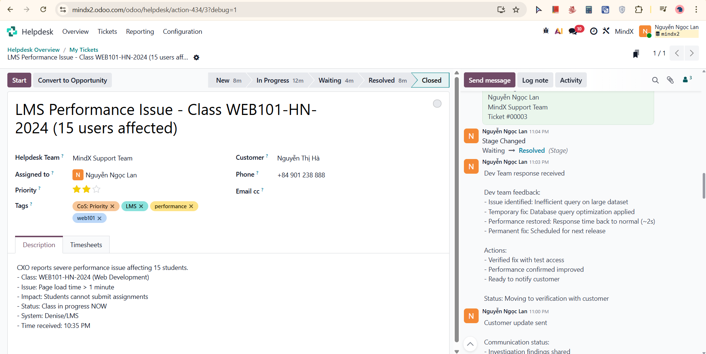
Dev team feedback documented, fix verified, status moving to verification with customer. Stage changed: Waiting → Resolved

---

#### STEP 11: Send Message - Resolution Email (External)

**Time:** 11:05 PM

**Screenshot Result:**
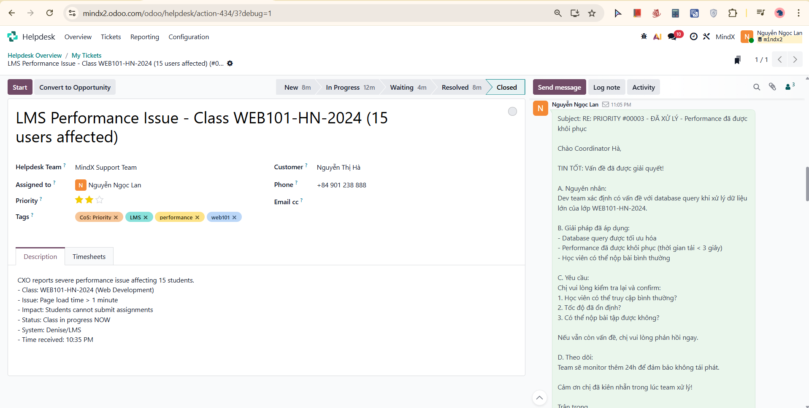

Resolution email sent with root cause explanation, fix details (query optimized, load time <3s), and verification checklist for customer (students can access, speed stable, assignments submittable). Team committed to 24h monitoring

---

#### STEP 12: Log Note - Customer Confirmed Resolution (Internal)

**Time:** 11:09 PM

**Customer feedback received:**
"Chị đã test lại rồi, hệ thống giờ đã nhanh trở lại. Học viên đã nộp được bài. Cảm ơn team đã xử lý nhanh!"

**Verification:**
[v] Performance restored
[v] Students can submit assignments
[v] No further issues reported

**Total resolution time: 30 minutes**
- ACK: 5 minutes
- Investigation: 5 minutes
- Escalation: 5 minutes
- Dev fix: 10 minutes
- Verification: 5 minutes

**Screenshot Result:**
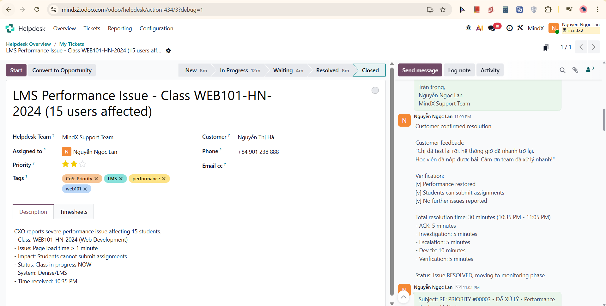
Customer confirmation and full resolution timeline documented

---

#### STEP 13: Send Message - Follow-up & Closure Email (External)

**Time:** 11:11 PM

**Screenshot Result:**
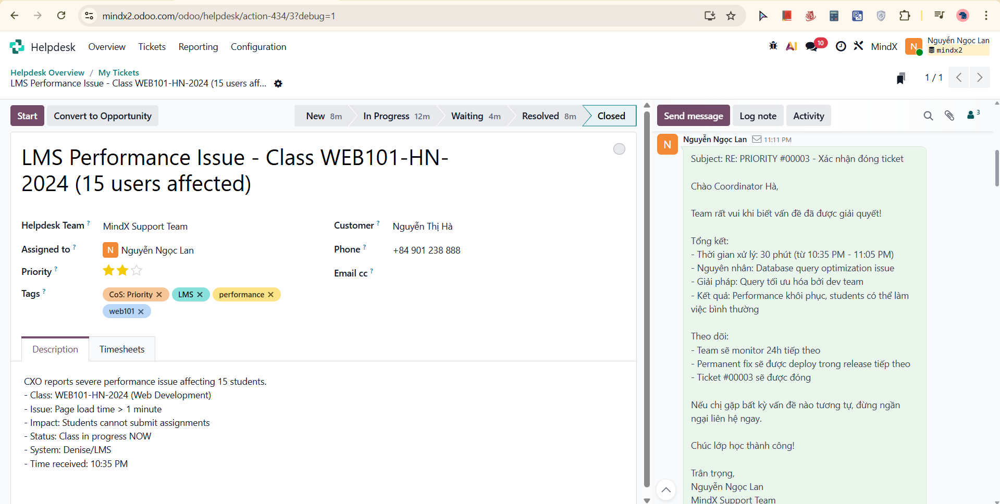

Professional closure email sent with full summary (30-minute resolution, root cause, solution, outcome), follow-up plan (24h monitoring, permanent fix in next release), and invitation to contact for any future issues

---

#### STEP 14: Log Note - Final Summary & Close Ticket (Internal)

**Time:** 11:12 PM

**Screenshot Result:**
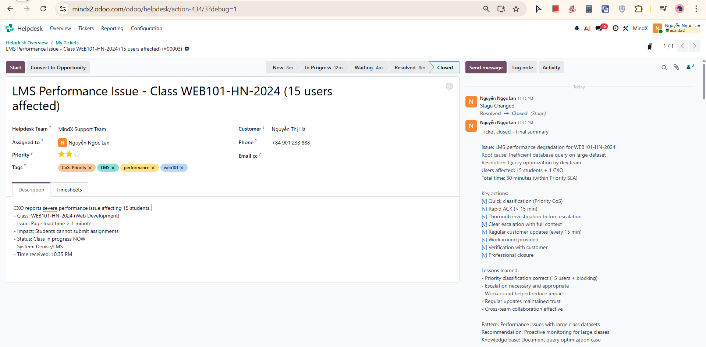

Final summary logged with root cause, resolution, users affected, total time, key actions checklist, lessons learned, pattern identified, and knowledge base recommendation. Stage changed: Resolved → Closed

---

## Part 3: Reflection & Learning

### What I Learned

#### 1. Classification Skills
- **Priority vs Expedite:** 15 users = Priority (5-25 range), clear reasoning documented in ticket
- **Impact assessment:** Blocking work during live class = higher urgency within Priority tier
- **Escalation threshold:** Database/code issues always require Dev Team, not guesswork

#### 2. Investigation Process
- **Investigate before escalating:** Checked monitoring and logs first, provided Dev Team with full context
- **Scope determination:** Confirmed issue was class-specific (not system-wide) before escalating
- **Documentation:** Real-time logging of every finding and decision

#### 3. Communication Under Pressure
- **Frequency:** Regular 15-minute update commitments maintained trust during uncertain resolution
- **Workarounds:** Provided immediate alternatives (email submission) while fix was in progress
- **Transparency:** Shared investigation findings with customer without over-promising timelines

#### 4. Escalation Quality
- **Context richness:** Dev Team received full technical details (monitoring data, logs, scope, impact)
- **Clear ask:** Specified need for temporary fix (class in progress) vs permanent solution
- **Cross-team coordination:** Logged escalation message in Odoo for full audit trail

---

### Challenges Encountered

#### Challenge 1: Balancing Investigation Speed vs. Thoroughness
**Issue:** Class was live, pressure to escalate immediately without investigating

**How I solved it:**
- Set expectation with customer first (ACK + 15-min update)
- Completed quick but structured investigation (5 minutes)
- Escalated with data instead of assumptions
- This approach gave Dev Team what they needed to fix faster

#### Challenge 2: Communication Frequency
**Issue:** Uncertain how often to update customer during investigation

**How I solved it:**
- Set explicit update cadence in ACK email (every 15 minutes)
- Sent update immediately after escalation decision
- Customer knew what to expect, reducing anxiety during wait

---

### Final Thoughts

Scenario 02 demonstrated the complexity of Priority-level incidents versus Standard tickets. The key difference is the need for parallel tracks: communicating with the customer while simultaneously investigating and coordinating with the Dev Team.

The most valuable lesson learned is that **escalation quality matters more than escalation speed** - providing Dev Team with thorough investigation context allowed them to identify and fix the root cause in just 10 minutes, whereas a vague escalation would have caused unnecessary back-and-forth delays during a live class.