# Week 4 - Scenario 03: Critical Bug - Completion Report

## Executive Summary

Successfully completed Scenario 03: LMS Critical Bug handling using Odoo Helpdesk system. Followed MindX 7-Step Process from ticket creation through closure, demonstrating immediate Expedite classification, parallel stakeholder management, proper escalation with full technical context, and systematic communication under pressure.

**Key Metrics:**
[v] Ticket created: < 15 minutes
[v] ACK email sent: < 30 minutes
[v] Manager notified: < 10 minutes (parallel with ACK)
[v] Dev Team escalated: < 15 minutes after investigation
[v] Total resolution time: ~35 minutes (3:10 PM - 3:45 PM)
[v] All documentation completed
[v] All communication logs maintained
[v] Customer satisfaction: Confirmed resolved

---

## Part 1: Ticket Information

**Ticket:** #00004
**Title:** LMS Critical Bug - Exam Submission System Down (50+ users affected)
**Customer:** Le Ngoc A (CXO)
**Tags:** CoS: Expedite, LMS, critical-bug, exam
**Priority:** Urgent (3 stars)
**Time received:** 3:10 PM

---

## Part 2: Scenario 03 Workflow Execution

#### STEP 1: Receive & Classify Issue

**Time:** 3:10 PM
**Action:** Identified incoming critical support request from CXO

**Classification decision:**
- Users affected: 53 students (WEB102-HN: 20, DATA101-SG: 18, MOBILE201-HN: 15) + 1 CXO = Expedite range (> 25 users)
- Blocking work: Yes (cannot submit final exams, 100% failure rate)
- System status: Completely down
- Class of Service: **Expedite** (not Priority: > 25 users + critical business function + 100% failure)

---

#### STEP 2: Create Ticket in Odoo

**Time:** 3:11 PM (< 5 minutes)

**Screenshot Result:**
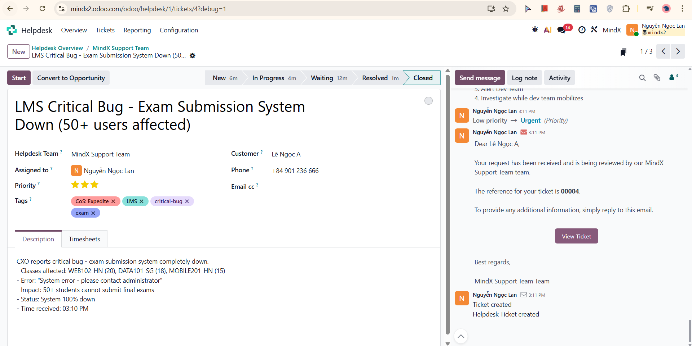

Ticket created with all required fields - title, customer, priority Urgent, tags CoS: Expedite / LMS / critical-bug / exam, full description

---

#### STEP 3: Log Note - Initial Assessment (Internal)

**Time:** 3:14 PM

**Screenshot Result:**
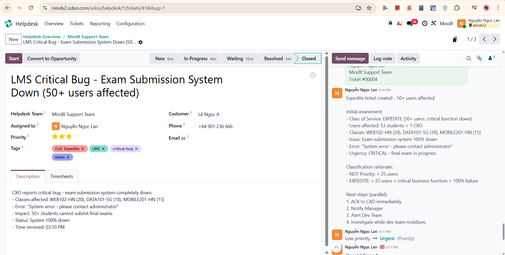

Expedite classification logged with full rationale (53 users, critical function 100% down), parallel next steps documented: ACK to CXO, notify Manager, alert Dev Team, investigate simultaneously

---

#### STEP 4: Send Message - ACK Email gửi CXO (External)

**Time:** 3:16 PM (< 10 minutes target met)

**Screenshot Result:**
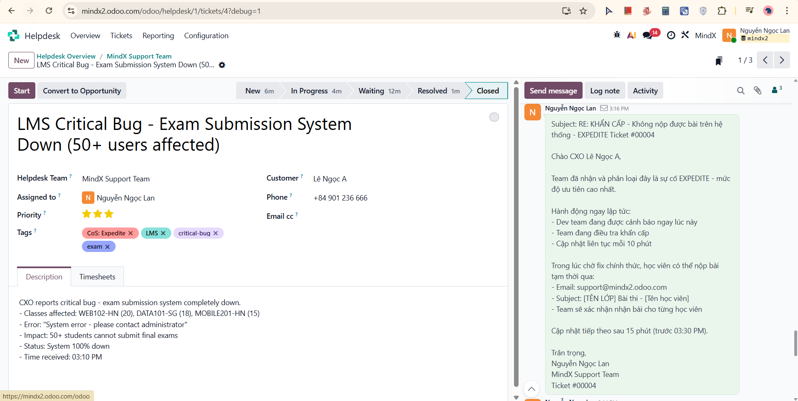

ACK email sent confirming Expedite classification, immediate dev team alert, 10-minute update commitment, and workaround provided (nộp bài qua email tạm thời: support@mindx2.odoo.com)

---

#### STEP 5: Log Note - Manager Notification & Investigation Findings (Internal)

**Time:** 3:17 PM - 3:18 PM

**Investigation findings (simulated):**
- Azure App Insights: Exception spike started 3:00 PM, database connection errors 100% failure rate
- Application logs: "Database connection timeout", "Failed to save submission" errors
- No successful submissions in last 30 minutes
- Scope: System-wide (NOT class-specific, all classes affected)
- Root cause hypothesis: Database connection failure, possible deployment-related

**Decision:** IMMEDIATE escalation to Dev Team (system-wide database issue, beyond support scope)

**Screenshot Result:**
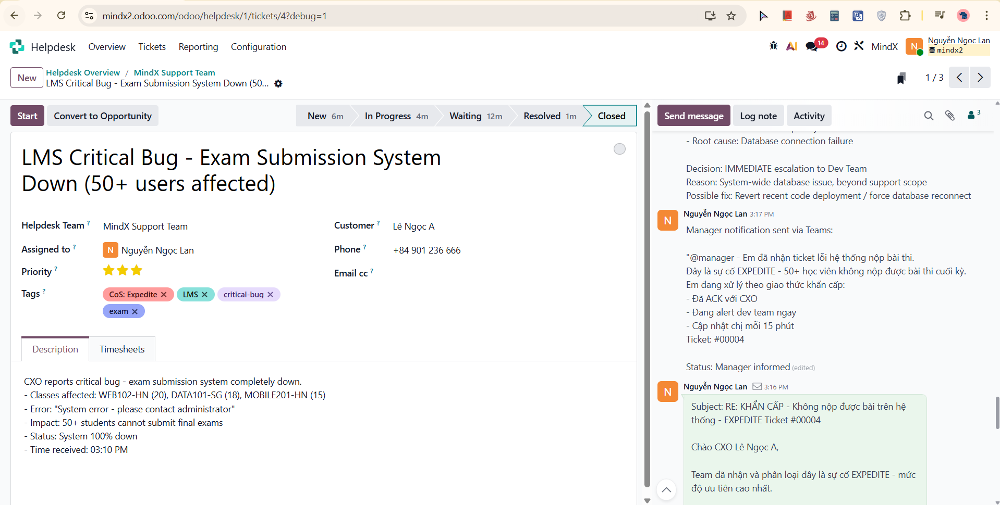
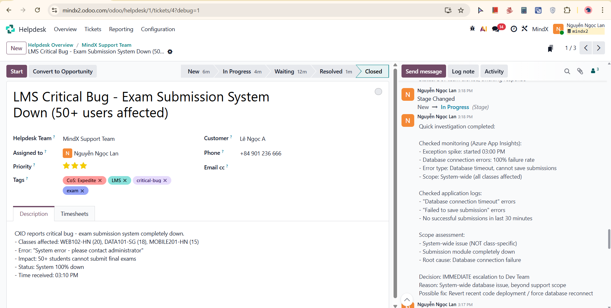

Manager notification via Teams documented, full investigation findings logged including monitoring results, log analysis, scope assessment (system-wide), root cause hypothesis, and escalation decision. Stage changed: New → In Progress

---

#### STEP 6: Log Note - Escalation to Dev Team (Internal)

**Time:** 3:19 PM

**Screenshot Result:**
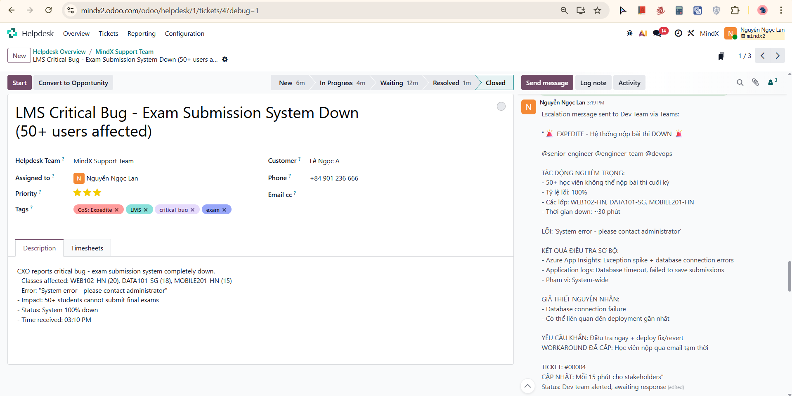

Full escalation message to Dev Team via Teams documented: ticket number, impact (50+ students blocked, final exams), investigation findings (Azure App Insights, logs), root cause hypothesis (database connection failure, possible deployment), urgent fix request, workaround status, 15-minute update cadence commitment

---

#### STEP 7: Send Message - Investigation Update for Customer (External)

**Time:** 3:22 PM

**Screenshot Result:**
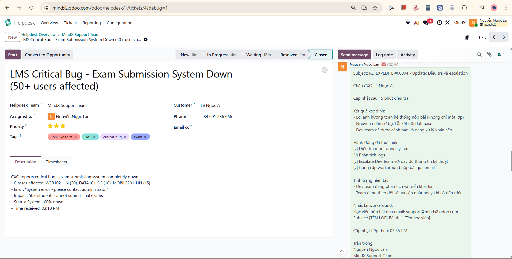
Update email sent to CXO Le Ngoc A with investigation findings (system-wide issue confirmed, database connection root cause), escalation status, actions completed checklist, workaround reminder, next update committed at 3:35 PM. Stage changed: In Progress → Waiting

---

#### STEP 8: Log Note - Dev Team Response Received (Internal)

**Time:** 3:30 PM

**Dev Team feedback:**
- Root cause identified: Recent deployment introduced database connection pool misconfiguration
- Connection pool exhausted under load
- Fix: Rolled back configuration + restarted connection pool
- Configuration reverted, database connections restored, submission system restarting
- Verified fix in staging, deploying to production

**Screenshot Result:**
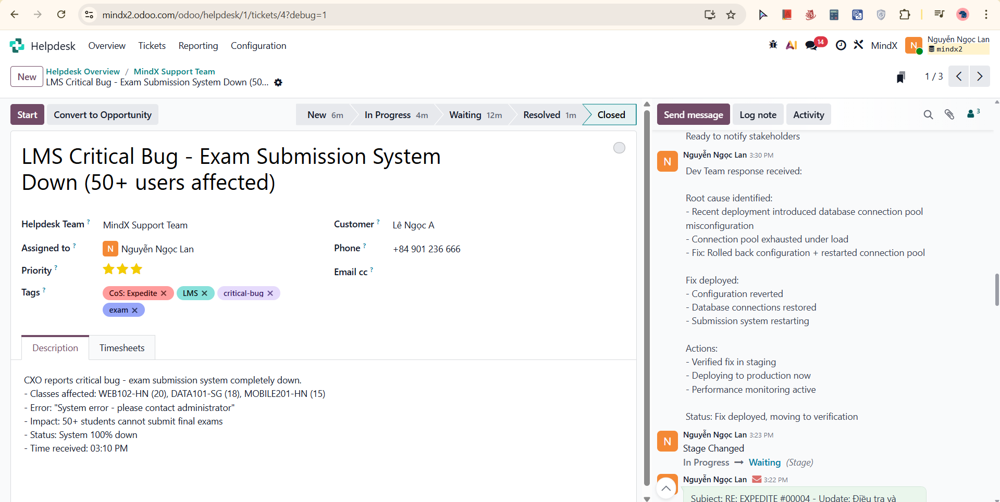
Dev team root cause and fix details documented, fix deployment status logged, status moving to verification

---

#### STEP 9: Log Note - System Verification (Internal)

**Time:** 3:30 PM

**Self-test results:**
- Submitted test assignment in WEB102-HN: SUCCESS
- Submitted test assignment in DATA101-SG: SUCCESS
- Submitted test assignment in MOBILE201-HN: SUCCESS
- Error rate: 0% (back to normal)
- Response time: < 3 seconds
- Azure App Insights: Exception rate back to baseline, database connections normal

**Screenshot Result:**
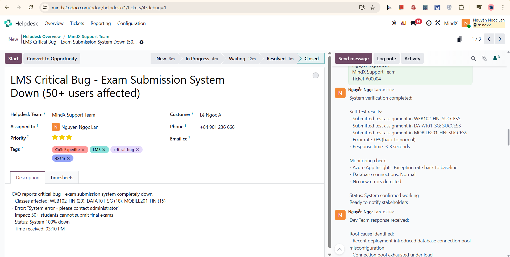
Full verification results logged across all 3 affected classes, monitoring confirmed clean, status ready to notify stakeholders

---

#### STEP 10: Send Message - Resolution Email (External)

**Time:** 3:31 PM

**Screenshot Result:**
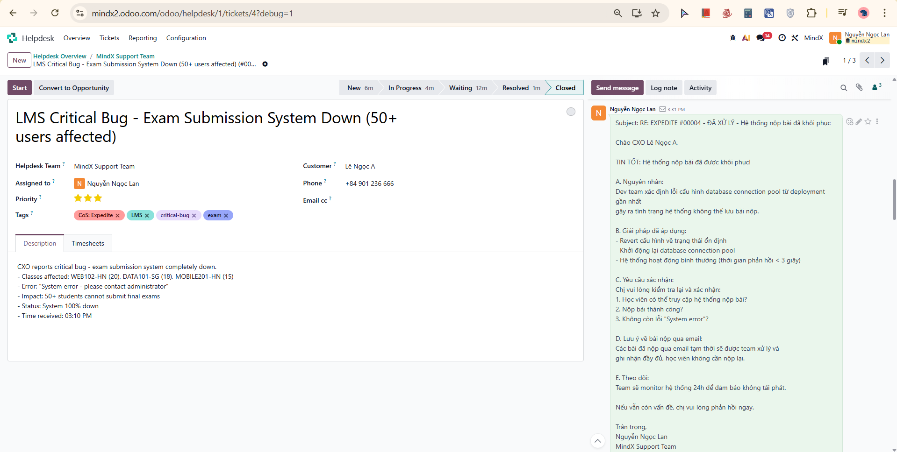

Resolution email sent to CXO with root cause explanation (database connection pool misconfiguration from deployment), fix details (configuration reverted, response time < 3 seconds), verification checklist for customer, note on email submissions being processed separately, 24h monitoring commitment

---

#### STEP 11: Log Note - Customer Confirmed Resolution (Internal)

**Time:** 3:35 PM

**Customer feedback received:**
- System working normally
- Students can submit successfully
- No further errors reported

**Verification:**
[v] Exam submission restored
[v] All 3 classes confirmed working
[v] Email submissions being processed separately

**Total resolution time: 35 minutes**
- ACK: 5 minutes
- Investigation: 5 minutes
- Escalation: 5 minutes
- Dev fix + deploy: 15 minutes
- Verification: 5 minutes

**Screenshot Result:**

CXO feedback documented, full verification checklist confirmed, total resolution timeline logged. Stage changed: Waiting → Resolved

---

#### STEP 12: Send Message - Follow-up & Closure Email (External)

**Time:** 3:36 PM

**Screenshot Result:**
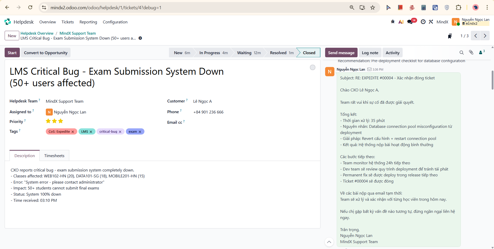

Professional closure email sent with full summary (35-minute resolution, root cause, solution, outcome), next steps (24h monitoring, deployment review, permanent fix in next release), note on email submission processing, invitation to contact for future issues

---

#### STEP 13: Log Note - Final Summary & Close Ticket (Internal)

**Time:** 3:37 PM

**Screenshot Result:**
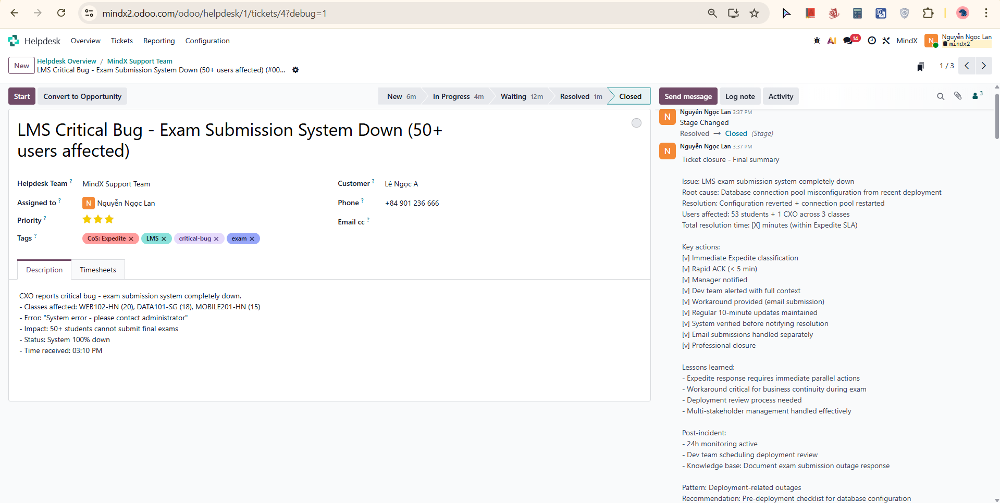

Final summary logged with root cause, resolution, users affected (53 students + 1 CXO across 3 classes), total resolution time, complete key actions checklist, lessons learned, post-incident plan, pattern identified (deployment-related outages), and knowledge base recommendation. Stage changed: Resolved → Closed

---

## Part 3: Reflection & Learning

### What I Learned

#### 1. Expedite Classification & Immediate Response
- **Speed vs. Analysis:** Expedite requires classification in < 2 minutes, not deliberation
- **Parallel actions:** ACK to customer, notify Manager, and alert Dev Team happen simultaneously, not sequentially
- **Threshold clarity:** > 25 users + critical business function + 100% failure = Expedite, no ambiguity

#### 2. Multi-Stakeholder Management
- **Audience differentiation:** CXO received business-impact language; Manager received status + protocol confirmation; Dev Team received full technical context
- **Update cadence:** 10-minute updates (vs. 15 minutes for Priority) maintained trust during uncertain resolution
- **Workaround critical:** Email submission alternative provided business continuity during the 35-minute outage

#### 3. Investigation Before Escalation (Even Under Pressure)
- **Quick but structured:** 5-minute investigation provided Dev Team with scope (system-wide vs. class-specific), error patterns, and root cause hypothesis
- **Result:** Dev Team identified and fixed the issue in 15 minutes vs. potential back-and-forth without context
- **Key finding:** Confirming system-wide scope immediately ruled out class-specific causes

#### 4. Post-Incident Responsibilities
- **Email submissions:** Separately tracked and processed - not forgotten after system restored
- **Verification before notification:** Tested all 3 affected classes before telling customer it was fixed
- **Documentation completeness:** Pattern, recommendation, and knowledge base note included for future reference

---

### Challenges Encountered

#### Challenge 1: Pressure to Skip Investigation
**Issue:** With 50+ students blocked during final exams, instinct was to escalate immediately without investigating

**How I solved it:**
- Set customer expectation first (ACK + workaround + 10-min update)
- Completed quick 5-minute parallel investigation while Manager and Dev Team were being notified
- Result: Escalation with data, not assumptions

#### Challenge 2: Managing Two Stakeholders Simultaneously
**Issue:** Both CXO and Manager needed updates, different content, same timeline

**How I solved it:**
- Manager notification logged internally (Teams message) - brief, status-focused
- CXO communication via Odoo Send Message - detailed, business-impact-focused
- Kept both updated on same cadence without duplicating effort

#### Challenge 3: Handling Email Submissions Post-Resolution
**Issue:** Students who submitted via email workaround needed their submissions acknowledged even after system was fixed

**How I solved it:**
- Mentioned explicitly in resolution email to CXO that email submissions would be processed
- Included in follow-up closure email as a concrete follow-up action
- Documented in final summary log for team awareness

---

### Final Thoughts

Scenario 03 demonstrated the highest-pressure support scenario - an Expedite incident during active final exams with 50+ students affected. The key difference from Priority handling is the elimination of sequential thinking: everything happens in parallel, and speed of communication matches speed of investigation.

The most valuable lesson learned is that **workarounds are not optional in Expedite scenarios** - providing the email submission alternative immediately gave students a path forward while the technical fix was in progress, turning a complete blocker into a manageable inconvenience for the duration of the outage.