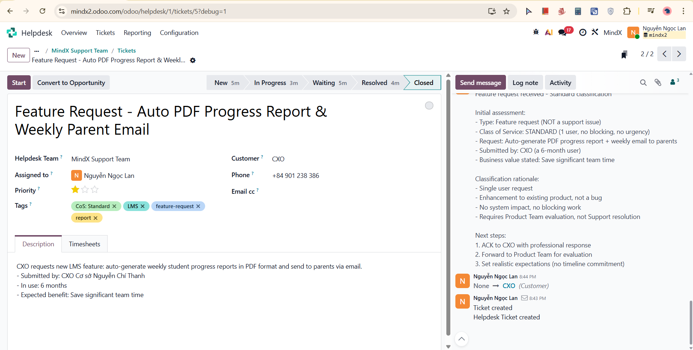
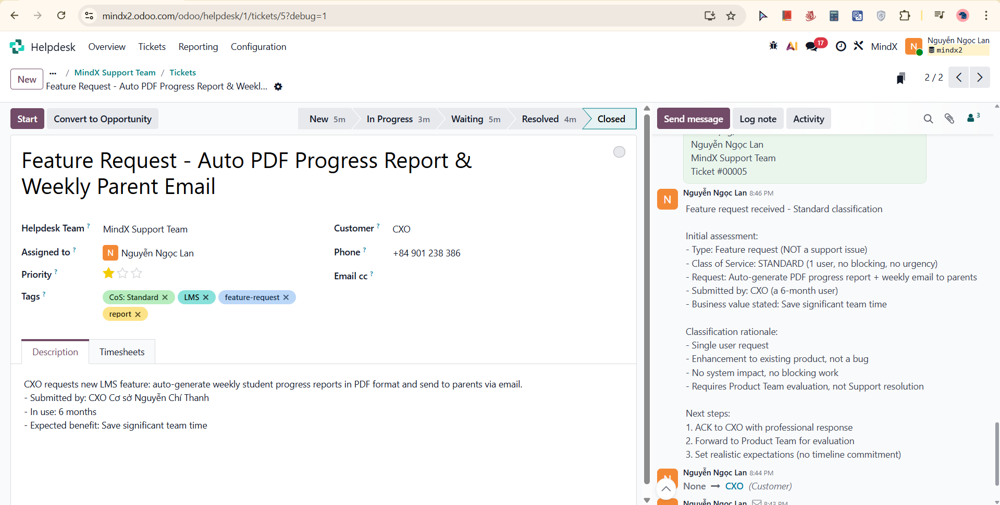
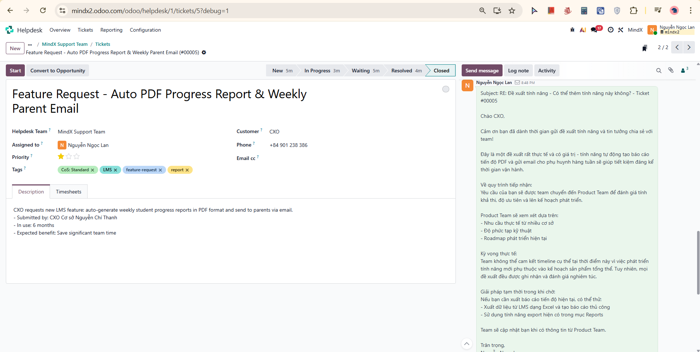
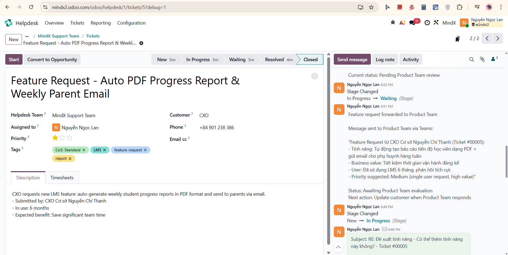
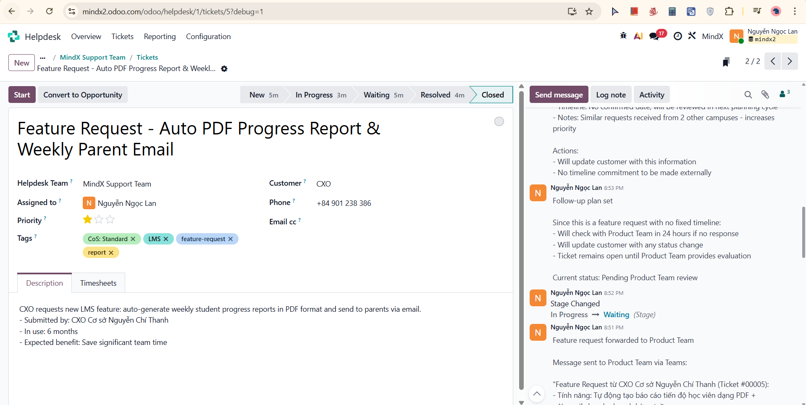
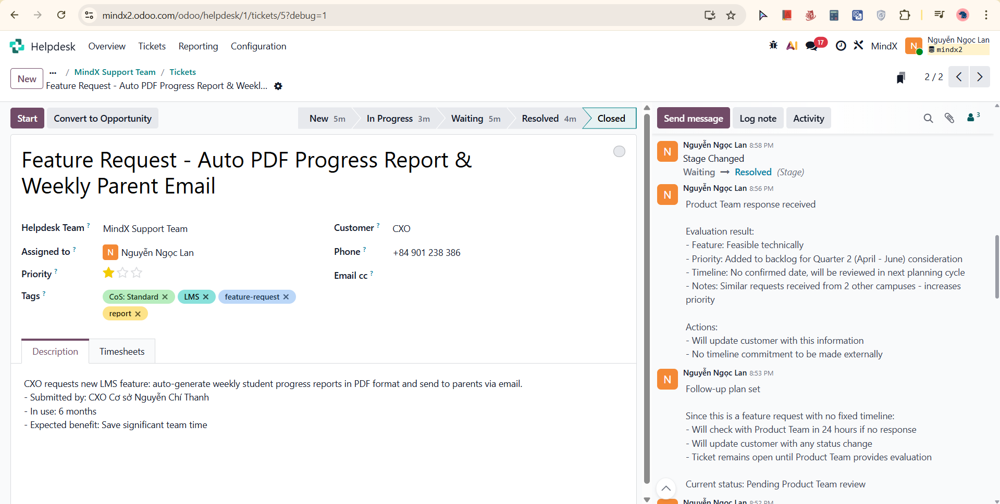
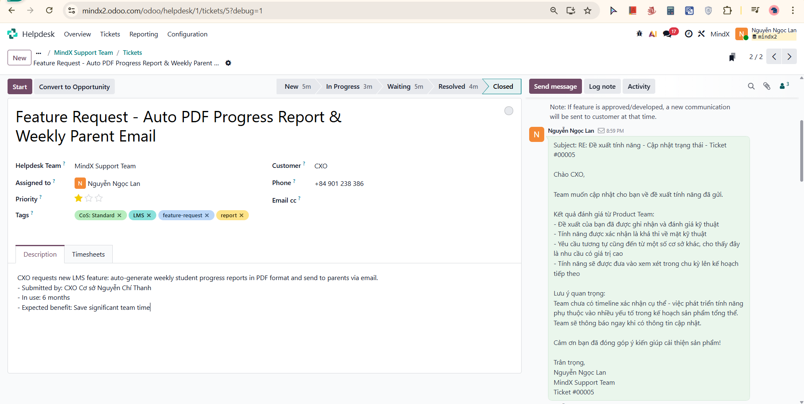
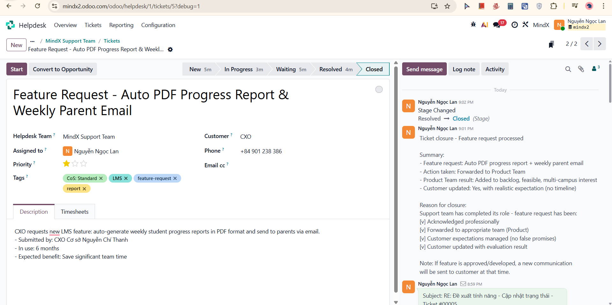

# Week 4 - Scenario 04: Feature Request - Completion Report

## Executive Summary

Successfully completed Scenario 04: Feature Request handling using Odoo Helpdesk system. Followed MindX 7-Step Process from ticket creation through closure, demonstrating proper classification as Standard, professional expectation management, appropriate forwarding to Product Team, and transparent communication without making false promises.

**Key Metrics:**
[v] Ticket created: < 15 minutes
[v] ACK email sent: < 30 minutes
[v] Feature request forwarded to Product Team: < 15 minutes
[v] Customer updated with evaluation result: same session
[v] All documentation completed
[v] All communication logs maintained
[v] Customer expectations managed: No timeline promised

---

## Part 1: Ticket Information

**Ticket:** #00005
**Title:** Feature Request - Auto PDF Progress Report & Weekly Parent Email
**Customer:** CXO (Cơ sở Nguyễn Chí Thanh)
**Tags:** CoS: Standard, LMS, feature-request, report
**Priority:** Normal (1 star)
**Time received:** 8:43 PM

---

## Part 2: Scenario 04 Workflow Execution

#### STEP 1: Receive & Classify Issue

**Time:** 8:43 PM
**Action:** Identified incoming feature request from CXO

**Classification decision:**
- Type: Feature request (NOT a support issue)
- Users affected: 1 CXO = Standard range
- Blocking work: No
- Class of Service: **Standard** (single user, no urgency, no system impact)
- Handler: Forward to Product Team, not Support resolution

---

#### STEP 2: Create Ticket in Odoo

**Time:** 8:43 PM (< 5 minutes)

**Screenshot Result:**

Ticket created with all required fields - title, customer, priority Normal, tags CoS: Standard / LMS / feature-request / report, description summarizing the request

---

#### STEP 3: Log Note - Initial Assessment (Internal)

**Time:** 8:46 PM

**Screenshot Result:**

Standard classification logged with full rationale (single user, enhancement not bug, no system impact, requires Product Team evaluation), and planned next steps documented

---

#### STEP 4: Send Message - ACK & Response Email (External)

**Time:** 8:48 PM (< 10 minutes target met)

**Screenshot Result:**

ACK email sent thanking CXO for the suggestion, explaining Product Team evaluation process, setting realistic expectations (no timeline commitment), and providing temporary workaround (Excel export + manual report)

---

#### STEP 5: Log Note - Feature Request Forwarded to Product Team (Internal)

**Time:** 8:51 PM

**Screenshot Result:**

Full forwarding message to Product Team via Teams documented including feature details, business value, user profile (6-month user, positive feedback), and suggested priority (Medium). Stage changed: New → In Progress

---

#### STEP 6: Log Note - Follow-up Plan (Internal)

**Time:** 8:53 PM

**Screenshot Result:**

Follow-up plan documented: check with Product Team in 24 hours if no response, update customer with any status change, ticket remains open until Product Team provides evaluation. Stage changed: In Progress → Waiting

---

#### STEP 7: Log Note - Product Team Response Received (Internal)

**Time:** 8:56 PM

**Product Team evaluation result:**
- Feature: Feasible technically
- Priority: Added to backlog for Quarter 2 (April - June) consideration
- Timeline: No confirmed date, will be reviewed in next planning cycle
- Notes: Similar requests received from 2 other campuses - increases priority

**Screenshot Result:**

Full Product Team evaluation documented, actions noted: update customer with information, no timeline commitment to be made externally. Stage changed: Waiting → Resolved

---

#### STEP 8: Send Message - Status Update Email (External)

**Time:** 8:59 PM

**Screenshot Result:**

Update email sent to CXO with Product Team evaluation results (technically feasible, added to backlog, multi-campus interest noted), clear statement that no confirmed timeline exists, and commitment to notify when there are updates

---

#### STEP 9: Log Note - Final Summary & Close Ticket (Internal)

**Time:** 9:01 PM

**Screenshot Result:**

Final summary logged with feature request details, action taken (forwarded to Product Team), evaluation result (backlog, feasible, multi-campus interest), customer updated with realistic expectation, and reason for closure. Stage changed: Resolved → Closed

---

## Part 3: Reflection & Learning

### What I Learned

#### 1. Feature Request vs. Support Issue
- **Different handler:** Feature requests go to Product Team, not resolved by Support
- **Different timeline:** Days/weeks, not minutes
- **Different success metric:** Not "fixed", but "properly forwarded and customer informed"
- **Support role ends when:** Customer has been acknowledged, request forwarded, and expectation set

#### 2. Expectation Management
- **Never promise timeline:** Product roadmap is outside Support's control
- **Never promise the feature will be built:** Only that it will be evaluated
- **Be specific about the process:** Explaining HOW requests are evaluated builds trust
- **Workaround matters:** Even for feature requests, offering temporary alternatives shows helpfulness

#### 3. Professional "Decline" Communication
- **Acknowledge the value:** CXO's suggestion was genuinely useful, say so
- **Explain the process:** Not a "no", but "here's how we handle this"
- **Keep them engaged:** Update when Product Team responds, don't let it disappear into a void
- **Multi-campus validation:** Sharing that similar requests came from other campuses reassures the customer their voice matters

#### 4. Internal Documentation Quality
- **Forward with context:** Product Team received user profile, business value, and suggested priority - not just "someone wants this"
- **Follow-up plan logged:** Ensures ticket is not forgotten while waiting for Product Team

---

### Challenges Encountered

#### Challenge 1: Temptation to Over-Promise
**Issue:** CXO made a compelling case for the feature - instinct was to say "we'll try to add this"

**How I solved it:**
- Kept language to "will be evaluated" and "will be reviewed"
- Focused on the process, not the outcome
- Redirected with a temporary workaround to show immediate value

#### Challenge 2: When to Close the Ticket
**Issue:** Feature not yet developed - unclear if ticket should stay open indefinitely

**How I solved it:**
- Support team's role is complete once: request forwarded + customer informed + expectation set
- Closed ticket after Product Team evaluation was communicated
- Noted in final log: if feature is approved/developed, a new communication will be sent at that time

---

### Final Thoughts

Scenario 04 highlighted a different kind of support skill - not technical troubleshooting, but professional communication and expectation management. The challenge is not solving a problem but responding to a request you cannot fulfill immediately in a way that keeps the customer satisfied and engaged.

The most valuable lesson learned is that **"not now" communicated well is better than a vague promise** - the CXO received a clear, respectful response with a real process explanation, which builds more trust than an empty "we'll look into it."
