# Week 4 - Scenario 05: Multi-User Issue - Completion Report

## Executive Summary

Successfully completed Scenario 05: Multi-User Video Playback Issue handling using Odoo Helpdesk system. Followed MindX 7-Step Process from ticket triage and consolidation through closure, demonstrating proper multi-ticket management, pattern recognition, Branch A diagnosis (server-side asset issue), appropriate escalation to Dev/Content Ops, and systematic communication throughout resolution.

**Key Metrics:**
[v] 3 tickets consolidated into 1 main ticket: < 15 minutes
[v] ACK email sent: < 30 minutes
[v] Branch A identified correctly via investigation
[v] Provided a temporary workaround + verified with sample users (hypothetical)
[v] Escalation to Dev/Content Ops with full context
[v] Total resolution time: ~45 minutes (2:37 PM - 3:08 PM)
[v] All documentation completed
[v] All communication logs maintained
[v] Customer satisfaction: Confirmed resolved

---

## Part 1: Ticket Information

**Main Ticket:** #00008
**Title:** Video Playback Issue - Lesson 3 Advanced JS (JS-ADV-HN-2412) - 12 users
**Customer:** CXO2
**Tags:** CoS: Priority, LMS, cdn, js-adv, lesson-3, video
**Priority:** High (2 stars)
**Time received:** 2:37 PM

**Duplicate Tickets:**
- Ticket #00006: "Video bài 3 không chạy - Lớp Advanced JS" - Customer: Nguyễn Văn A (Teacher)
- Ticket #00007: "Lesson 3 JS-ADV-HN-2412 loading mãi không xem được" - Customer: Nguyễn Thị Hà (CXO Coordinator)

---

## Part 2: Scenario 05 Workflow Execution

#### STEP 1: Receive & Triage - 3 Tickets, Same Issue

**Time:** 2:37 PM - 2:43 PM
**Action:** Identified 3 tickets received within 20 minutes reporting same issue

**Classification decision:**
- Users affected: 12 students (8 web Chrome 120+, 4 mobile iOS Safari/Android Chrome)
- Blocking work: Yes (cannot access lesson content during class)
- Class of Service: **Priority** (5-25 users, blocking activity)
- Pattern observed: Multi-device + multi-network (wifi + 4G) all failing → suggests server-side issue

---

#### STEP 2: Create Main Ticket & Consolidate

**Time:** 2:43 PM - 2:48 PM

**Screenshot Result:**
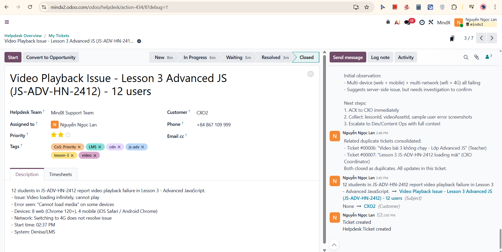
Main ticket #00008 created with full description (12 students, 3 classes devices, multi-network). 

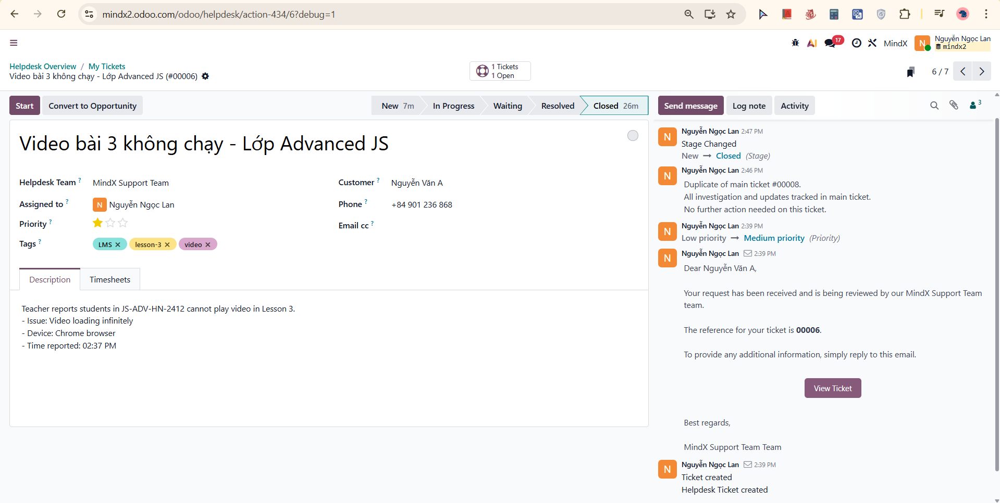

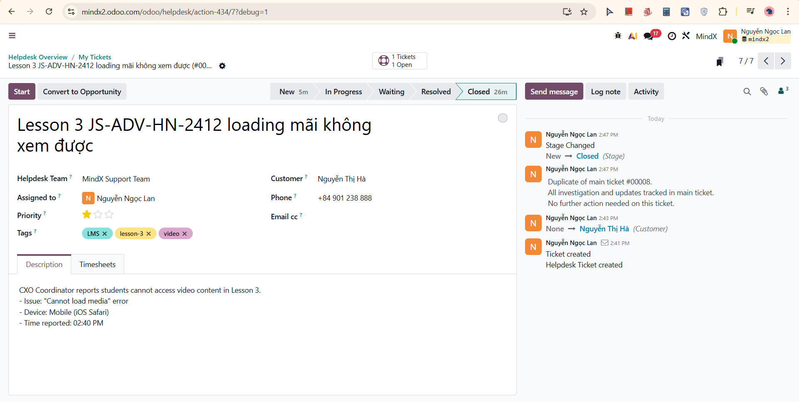

Duplicate tickets #00006 and #00007 closed with log note "Duplicate of main ticket #00008. All investigation and updates tracked in main ticket. No further action needed on this ticket." Stage changed: New → Closed on both duplicate tickets.

---

#### STEP 3: Log Note - Triage Summary & Ticket Consolidation (Internal)

**Time:** 2:52 PM

**Screenshot Result:**
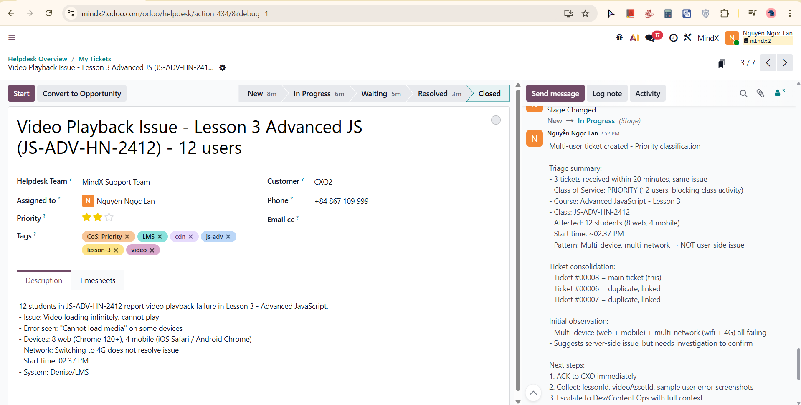
Full triage documented: 3 tickets received within 20 minutes, Priority classification rationale (12 users, blocking), ticket consolidation (main #00008, duplicates #00006 and #00007 linked), initial observation (multi-device/multi-network pattern suggests server-side), and next steps. Stage changed: New → In Progress

---

#### STEP 4: Send Message - ACK Email (External)

**Time:** 2:54 PM (< 15 minutes target met)

**Screenshot Result:**
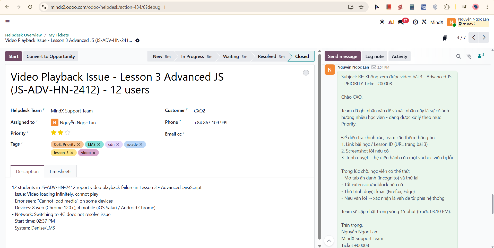
ACK email sent confirming Priority classification, requesting additional info (lesson URL, error screenshots, device/browser details), providing immediate workarounds (Incognito, disable extensions, try different browser), and committing to 15-minute update

---

#### STEP 5: Log Note - Investigation Findings - Branch A (Internal)

**Time:** 2:56 PM

**Investigation findings:**
- Lesson 1, 2, 4: video loads normally
- Lesson 3: API returns 403 Forbidden for video asset
- Affected asset: videoAssetId = VID-ADV-L3-001
- Error consistent across all users and networks
- Scope: ONLY Lesson 3 affected, other lessons and courses normal

**Root cause hypothesis:**
- Signed URL expired OR incorrect permission on video asset
- Possibly re-uploaded/replaced content with wrong config

**Branch A confirmed:** Server-side asset/permission issue (NOT user-side)

**Screenshot Result:**
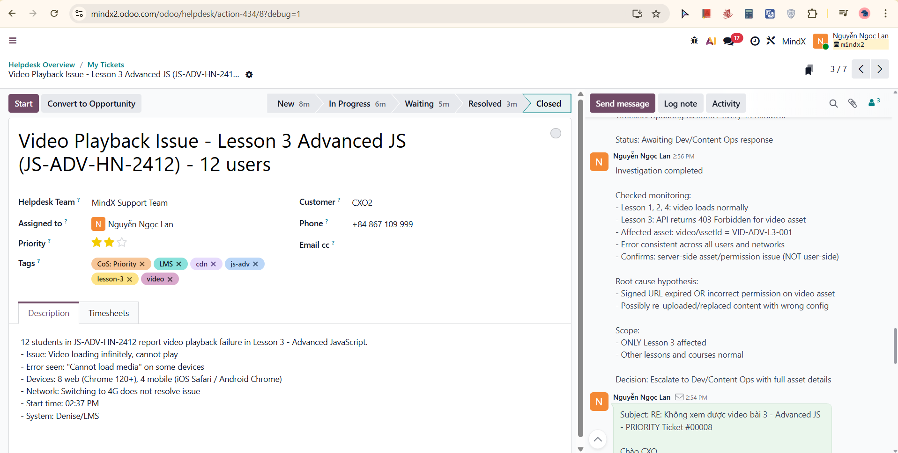
Full investigation findings documented including monitoring results, 403 error on Lesson 3 asset, scope assessment (lesson-specific), root cause hypothesis, and escalation decision to Dev/Content Ops

---

#### STEP 6: Log Note - Escalation to Dev/Content Ops (Internal)

**Time:** 2:57 PM

**Screenshot Result:**
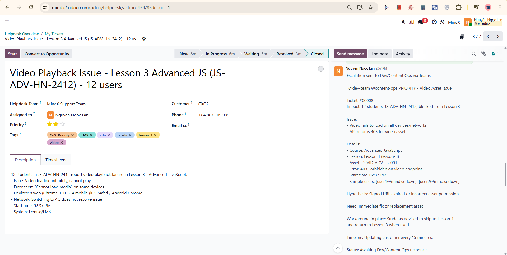
Full escalation message to Dev/Content Ops via Teams documented: ticket number, impact (12 students blocked from Lesson 3), issue details (403 Forbidden on video endpoint), asset ID (VID-ADV-L3-001), root cause hypothesis (signed URL expired or incorrect asset permission), workaround in place (students advised to skip to Lesson 4), 15-minute update cadence commitment

---

#### STEP 7: Send Message - Investigation Update Email (External)

**Time:** 2:58 PM

**Screenshot Result:**
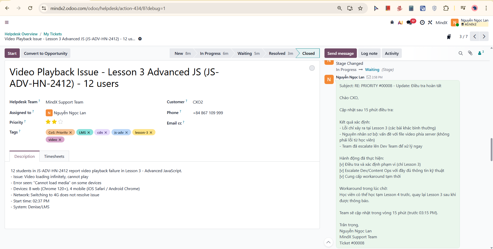
Update email sent to CXO confirming investigation complete, issue isolated to Lesson 3 (server-side, not user-side), Dev/Content Ops escalated with full technical context, workaround reminder (study Lesson 4 first, return to Lesson 3 after fix), next update committed at 3:15 PM. Stage changed: In Progress → Waiting

---

#### STEP 8: Log Note - Dev/Content Ops Response & Fix (Internal)

**Time:** 3:00 PM

**Dev/Content Ops feedback:**
- Root cause confirmed: Signed URL expired + incorrect permission after content re-upload
- Fix applied: New signed URL generated, asset permission corrected
- Video endpoint returning 200 OK, response time < 2 seconds
- Verified fix in staging before production deploy

**Screenshot Result:**
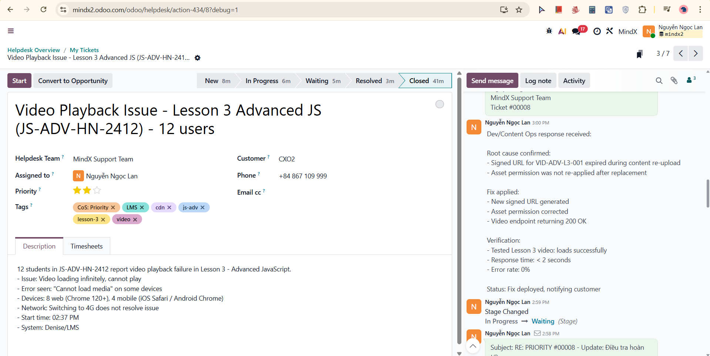
Dev/Content Ops root cause and fix details documented, verification results logged, status moving to customer notification

---

#### STEP 9: Send Message - Resolution Email (External)

**Time:** 3:01 PM

**Screenshot Result:**
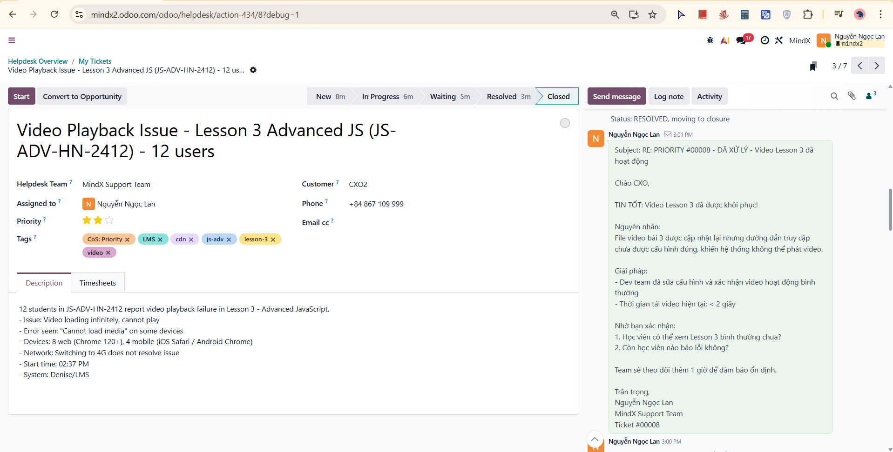
Resolution email sent to CXO confirming video Lesson 3 restored, root cause explained (video re-uploaded but access configuration not correctly applied), fix confirmed by Dev team (response time < 2 seconds), verification checklist sent to customer (students can watch Lesson 3, no further errors), 1-hour monitoring commitment

---

#### STEP 10: Log Note - Customer Confirmed Resolution (Internal)

**Time:** 3:04 PM

**Customer feedback received:**
- Students can watch Lesson 3 normally
- No further errors reported
- Students who used workaround (Lesson 4 first) returning to Lesson 3

**Verification:**
[v] Video playback restored
[v] All 12 affected students confirmed OK
[v] No new reports

**Total resolution time: ~45 minutes**
- ACK: 10 minutes
- Investigation: 10 minutes
- Escalation: 5 minutes
- Dev fix: 15 minutes
- Verification: 5 minutes

**Screenshot Result:**
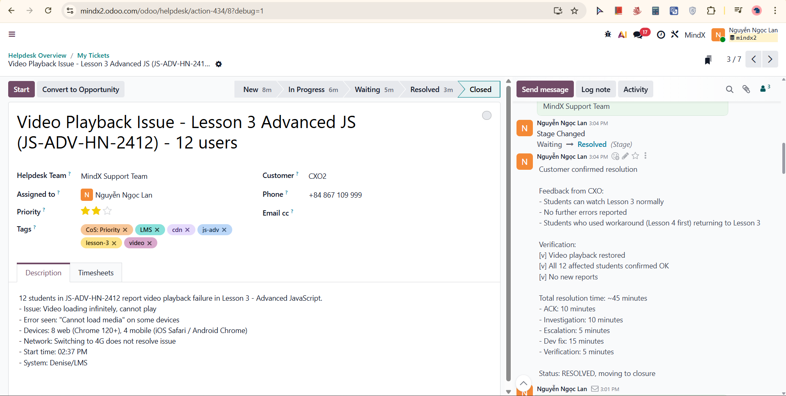
CXO feedback documented, full verification checklist confirmed, total resolution timeline logged. Stage changed: Waiting → Resolved

---

#### STEP 11: Send Message - Closure Email (External)

**Time:** 3:06 PM

**Screenshot Result:**
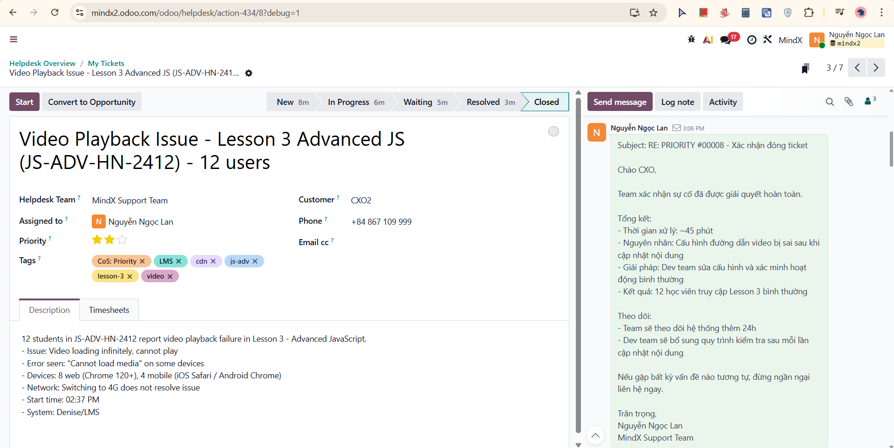
Professional closure email sent with full summary (45-minute resolution, root cause, solution, 12 students restored), follow-up plan (24h monitoring, Dev team adding post-upload verification checklist), invitation to contact for future issues

---

#### STEP 12: Log Note - Final Summary & Close Ticket (Internal)

**Time:** 3:07 PM

**Screenshot Result:**
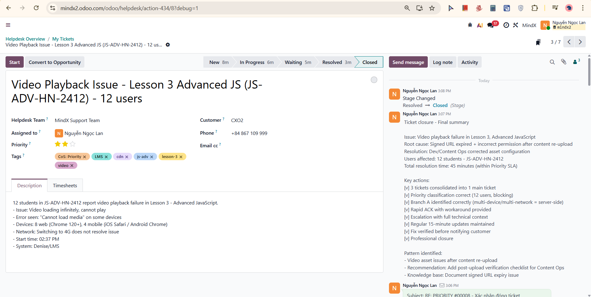
Final summary logged with root cause (signed URL expired + incorrect permission after content re-upload), resolution (Dev/Content Ops corrected asset configuration), users affected (12 students JS-ADV-HN-2412), total resolution time (45 minutes within Priority SLA), complete key actions checklist, pattern identified (video asset issues after content re-upload), and knowledge base recommendation (document signed URL expiry issue). Stage changed: Resolved → Closed

---

## Part 3: Reflection & Learning

### What I Learned

#### 1. Multi-Ticket Triage & Consolidation
- **Pattern recognition:** 3 tickets in 20 minutes = same root cause, not separate issues
- **Consolidation first:** Create main ticket before investigating to avoid duplicate work
- **Duplicate handling:** Close duplicate tickets immediately with clear reference to main ticket
- **Single source of truth:** All updates, investigation, and communication in main ticket only

#### 2. Branch Selection via Evidence
- **Branch A confirmed by data:** 403 error on API, consistent across all devices and networks = server-side
- **Did not guess:** Waited for investigation results before selecting branch
- **Scope determination critical:** Confirming issue was Lesson 3 only (not system-wide) prevented unnecessary system-level escalation

#### 3. Workaround Quality
- **Specific and actionable:** "Study Lesson 4 first, return to Lesson 3 after fix" = students could continue learning
- **Communicated immediately:** In ACK email before investigation was complete
- **Tracked to closure:** Confirmed students who used workaround successfully returned to Lesson 3

#### 4. Escalation with Technical Context
- **Asset ID included:** Dev/Content Ops received exact videoAssetId (VID-ADV-L3-001), not just "video broken"
- **Error code included:** 403 Forbidden told Dev team exactly where to look
- **Hypothesis provided:** Suggested signed URL expiry gave Dev team a starting point
- **Result:** Fix identified and deployed in 15 minutes

---

### Challenges Encountered

#### Challenge 1: Order of Operations - Tickets Before Investigation
**Issue:** Instinct was to investigate immediately when tickets came in

**How I solved it:**
- Created and consolidated tickets first (3 minutes)
- Then investigated with full context already documented
- Prevented scattered updates across multiple tickets

#### Challenge 2: Workaround for Content Issue
**Issue:** Unlike system outages, a single lesson being broken is harder to work around

**How I solved it:**
- Suggested skipping Lesson 3 and continuing with Lesson 4
- Kept workaround realistic (not "download the video separately")
- Followed up to ensure workaround students returned to Lesson 3 after fix

---

### Final Thoughts

Scenario 05 introduced the added complexity of multi-ticket management on top of standard Priority incident handling. The key skill demonstrated is recognizing when multiple tickets represent one problem, consolidating quickly, and then treating it as a single investigation rather than three separate support conversations.

The most valuable lesson learned is that **ticket consolidation saves time for everyone** - the customer gets one coherent communication thread, the support agent avoids duplicating investigation work, and the Dev team receives one clear escalation instead of three fragmented reports.