# Week 4 - Scenario 06: Fixed Deadline Request - Completion Report

## Executive Summary

Successfully completed Scenario 06: Fixed Deadline Request handling using Odoo Helpdesk system. Followed MindX 7-Step Process from ticket creation through closure, demonstrating proper classification as Fixed Deadline, scope clarification before commitment, realistic MVP proposal, data access approval workflow, regular progress updates, and on-time delivery with buffer.

**Key Metrics:**
[v] Ticket created: < 15 minutes
[v] ACK email sent: < 30 minutes
[v] Scope clarified before any timeline commitment
[v] Scope proposal sent with MVP + nice-to-have structure
[v] Data access approval requested and received
[v] Day 1 progress update sent
[v] Day 2 core report update sent
[v] Report delivered: 6:00 PM Day 2 (exactly as committed, 15 hours before meeting)
[v] All documentation completed
[v] All communication logs maintained
[v] No over-promise made at any stage

---

## Part 1: Ticket Information

**Ticket:** #00009
**Title:** Fixed Deadline - Enrollment Report for Director Meeting (Due 09:00 Day 3)
**Customer:** Mr.Director
**Tags:** CoS: Fixed Deadline, director, enrollment, reporting
**Priority:** High (2 stars)
**Time received:** 9:24 PM (Day 1)

---

## Part 2: Scenario 06 Workflow Execution

#### STEP 1: Receive & Classify Issue

**Time:** 9:24 PM
**Action:** Identified incoming Fixed Deadline request from Director

**Classification decision:**
- Type: Data reporting request with hard deadline
- Users affected: Director + meeting participants
- Blocking work: Yes (Director meeting at 09:00 AM Day 3 - HARD DEADLINE)
- Class of Service: **Fixed Deadline** (time-driven, not user-count-driven)
- Handler: Support team executes, requires data access approval from VP/Manager
- Key risk: Scope ambiguous - cannot commit to timeline before clarification

**Risks identified:**
- Scope ambiguous (need clarification)
- Data permissions unclear
- Metric definitions unclear
- Multiple data sources possible
- PII concerns (student names?)

---

#### STEP 2: Create Ticket in Odoo

**Time:** 9:24 PM (< 5 minutes)

**Screenshot Result:**
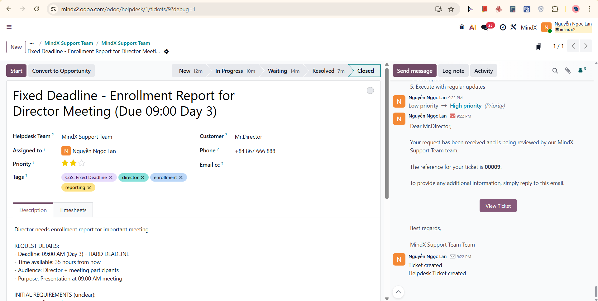
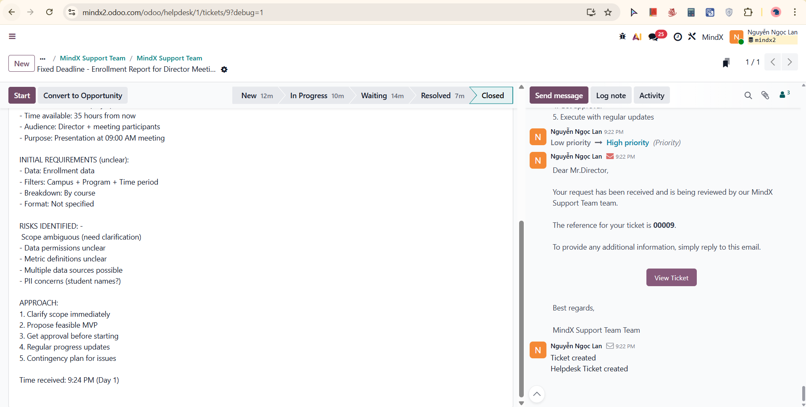
Ticket #00009 created with all required fields - title including deadline, customer Mr.Director, priority High (2 stars), tags CoS: Fixed Deadline / director / enrollment / reporting, full description including request details, initial requirements (unclear), risks identified, and approach planned.

---

#### STEP 3: Log Note - Initial Assessment (Internal)

**Time:** 9:27 PM

**Screenshot Result:**
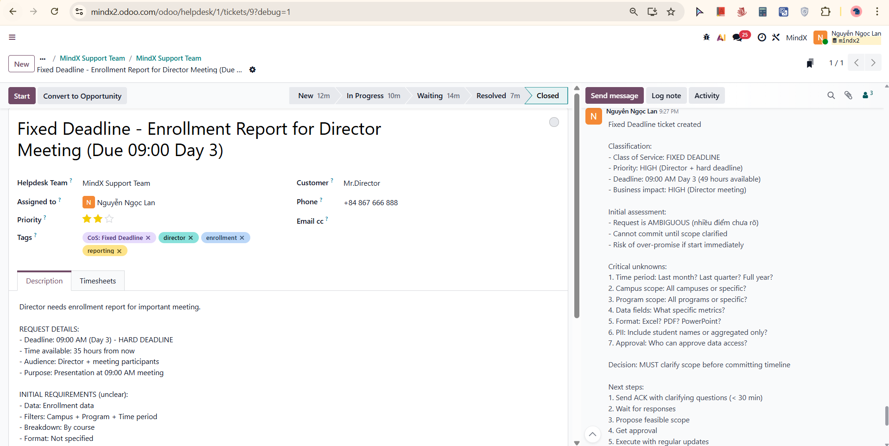
Fixed Deadline classification logged with full rationale. Key assessment: request is AMBIGUOUS - cannot commit until scope clarified. Risk of over-promise if starting immediately. Critical unknowns documented (7 items): time period, campus scope, program scope, data fields, format, breakdown definition, and approval authority. Decision: MUST clarify scope before committing timeline. Next steps: send ACK with clarifying questions (< 30 min), wait for responses, then propose feasible scope.

---

#### STEP 4: Send Message - ACK & Clarification Email (External)

**Time:** 9:31 PM (< 10 minutes target met)

**Screenshot Result:**
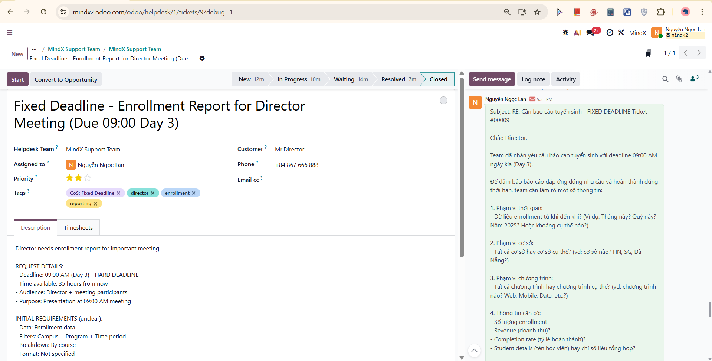
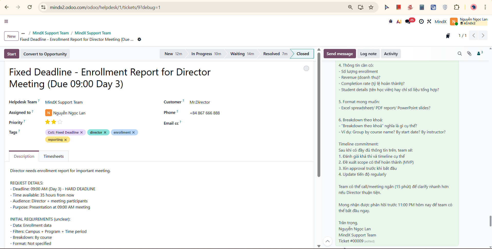
ACK email sent in Vietnamese to Director confirming receipt of enrollment report request with 09:00 AM Day 3 deadline. Six clarifying questions asked: (1) time period scope, (2) campus scope, (3) program scope, (4) data fields required, (5) output format, (6) breakdown definition. Timeline strategy: NOT committing to timeline yet. Offered 15-minute call option for faster clarification. Requested response before 11:00 PM to allow team to start immediately. Stage changed: New → In Progress (logged separately).

---

#### STEP 5: Log Note - ACK Sent (Internal)

**Time:** 9:32 PM

**Screenshot Result:**
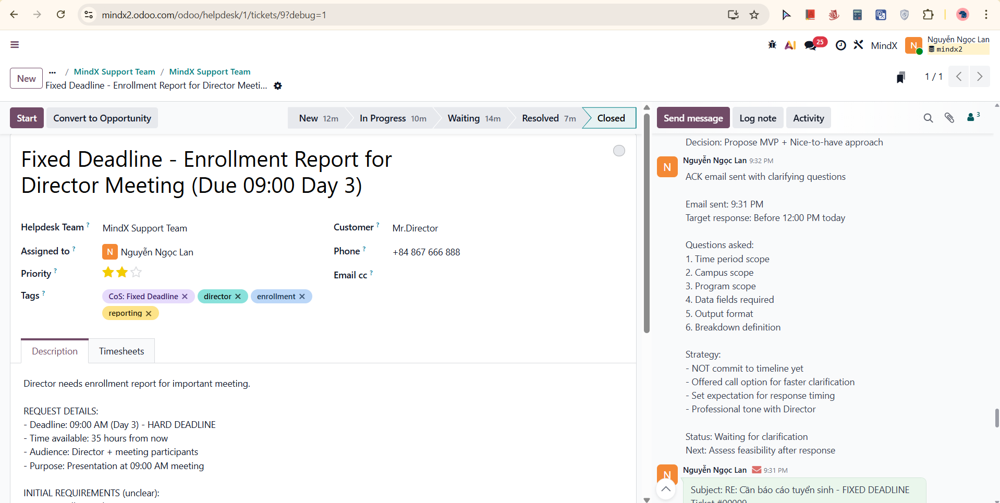
ACK email confirmed sent at 9:31 PM. Questions asked documented (6 items): time period scope, campus scope, program scope, data fields, output format, breakdown definition. Strategy noted: did not over-promise, offered call option for faster clarification, set expectation for response timing, professional tone maintained with Director. Status: Waiting for clarification. Next: assess feasibility after response.

---

#### STEP 6: Log Note - Director Response Received (Internal)

**Time:** 9:34 PM

**Director clarification provided:**
- Time period: January 2025 (last month)
- Campus: All campuses
- Program: All programs
- Data fields needed: Total enrollment count, enrollment by campus, enrollment by program, revenue by campus, revenue by program
- Format: Excel file preferred
- Breakdown: By course = group by course name, show count + revenue

**Additional requests from Director:**
- Trend comparison with December 2024
- Top 5 performing courses

**Scope assessment after receiving clarification:**
- [v] Feasible: Core requirements doable
- [v] Time sufficient: 39 hours remaining
- [!] Additional requests: Trend + top 5 may be tight
- [!] Data access: Need to verify permissions

**Decision:** Propose MVP + Nice-to-have approach. Stage changed: New → In Progress.

**Screenshot Result:**
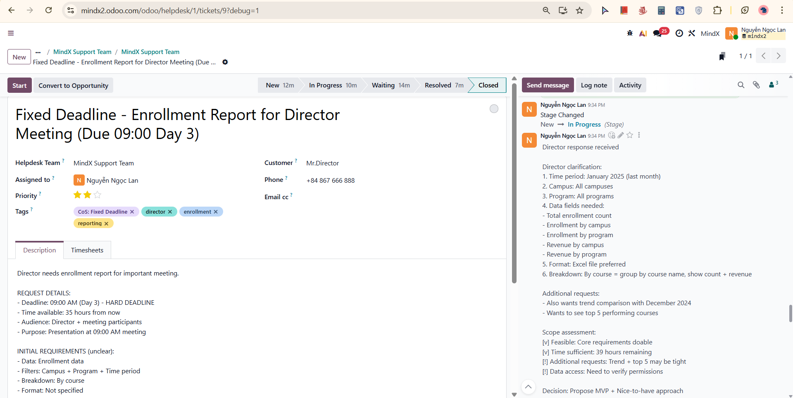
Full Director clarification documented with scope assessment. Decision to propose MVP + nice-to-have structure before committing.

---

#### STEP 7: Send Message - Scope Confirmation & Timeline Email (External)

**Time:** 9:39 PM

**Screenshot Result:**
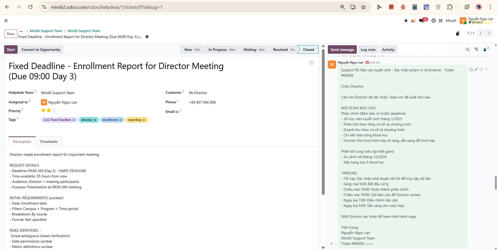
Scope confirmation email sent to Director in Vietnamese. Content structured as: (1) Core MVP - guaranteed delivery (enrollment data January 2025, breakdown by campus/program/course, revenue integrated, Excel format), (2) Enhancements - best effort only (trend comparison December vs January, top 5 courses). Timeline committed: tonight - internal approval for data access; morning Day 2 - begin processing; afternoon Day 2 14:00 - complete core report; afternoon Day 2 18:00 - send report for Director review; Day 3 07:00 - adjust if needed; Day 3 09:00 - ready for meeting. Requested Director confirmation to proceed. Target response: before 11:00 PM tonight.

---

#### STEP 8: Log Note - Scope Proposal Sent (Internal)

**Time:** 9:42 PM

**Screenshot Result:**
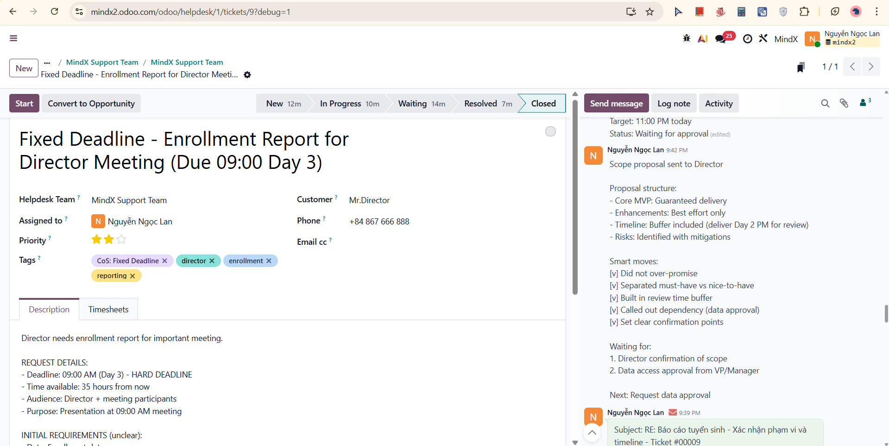
Scope proposal details documented. Proposal structure: Core MVP (guaranteed delivery), Enhancements (best effort only), Timeline with buffer included (deliver Day 2 6:00 PM for review), Risks identified with mitigations. Smart moves noted: did not over-promise, separated must-have vs nice-to-have, built in review time buffer, called out data approval dependency, set clear confirmation points. Waiting for: (1) Director confirmation of scope, (2) data access approval from VP/Manager. Next: request data approval.

---

#### STEP 9: Log Note - Data Access Approval Requested (Internal)

**Time:** 9:44 PM

**Screenshot Result:**
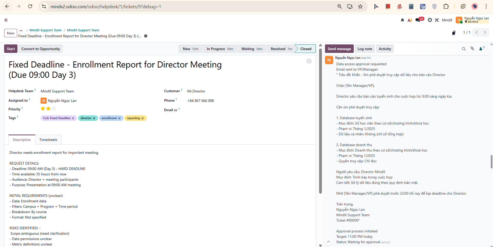
Data access approval email sent to VP/Manager documented. Email subject: "Khan - Xin phe duyet truy cap du lieu cho bao cao Director." Two database access requests submitted: (1) Enrollment database - purpose: student count by campus/program/course, scope: January 2025, no PII (aggregate only); (2) Revenue database - purpose: revenue by campus/program/course, scope: January 2025, read-only access. Requestor: Director MindX. Purpose: board meeting presentation. Data handling commitment: per security policy. Target approval: before 11:00 PM tonight. Approval process initiated.

---

#### STEP 10: Log Note - All Approvals Received (Internal)

**Time:** 9:44 PM

**Approvals received:**
- Director confirmed scope: Core MVP approved, enhancements "best effort" understood, timeline 6:00 PM Day 2 accepted
- VP/Manager approved data access: Enrollment DB (read-only approved), Revenue DB (aggregate only approved). Conditions: No PII export, delete after delivery.

**Status:** Ready to execute. Timeline confirmed: start now, deliver 6:00 PM Day 2. Stage changed: In Progress → Waiting (pending execution completion).

**Screenshot Result:**
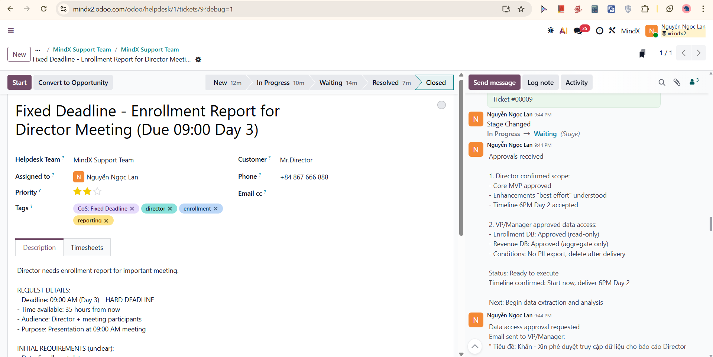
Both Director and VP/Manager approvals documented in full with conditions noted. Execution phase begins.

---

#### STEP 11: Send Message - Day 1 Progress Update Email (External)

**Time:** 9:47 PM

**Screenshot Result:**
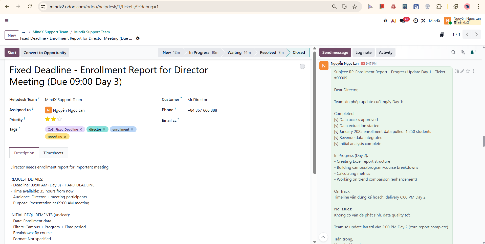
End-of-Day 1 progress update email sent to Director. Completed: data access approved, data extraction started, January 2025 enrollment data pulled (1,250 students), revenue data integrated, initial analysis complete. In Progress for Day 2: creating Excel report structure, building campus/program/course breakdowns, calculating metrics, working on trend comparison (enhancement). Status: ON TRACK. Timeline remains: delivery 6:00 PM Day 2. No issues. Next update: 2:00 PM Day 2 (core report complete).

---

#### STEP 12: Log Note - Day 1 Progress Update Sent (Internal)

**Time:** 9:50 PM

**Screenshot Result:**
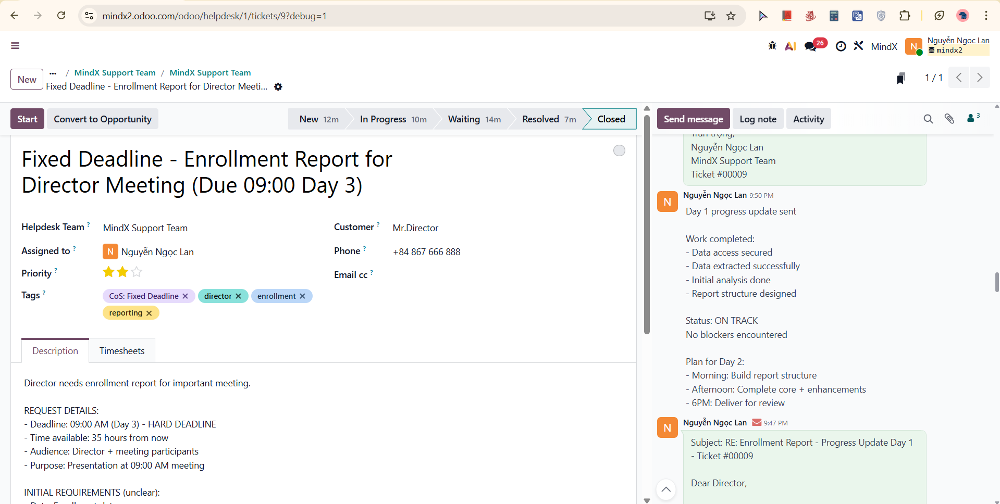
Day 1 progress update documented. Work completed: data access secured, data extracted successfully, initial analysis done, report structure designed. Status: ON TRACK. No blockers encountered. Plan for Day 2: morning - build report structure, afternoon - complete core + enhancements, 6:00 PM - deliver for review.

---

#### STEP 13: Send Message - Day 2 Core Report Update Email (External)

**Time:** 9:52 PM

**Screenshot Result:**
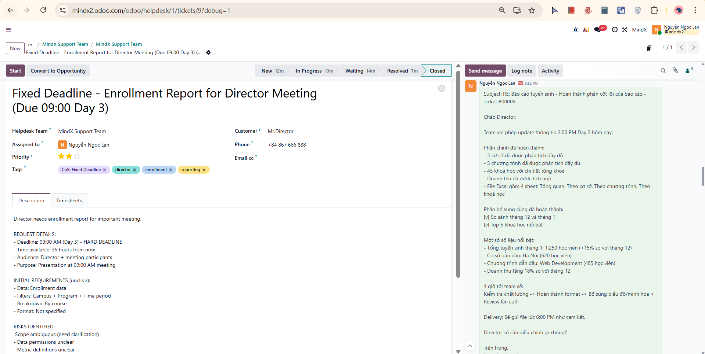
2:00 PM Day 2 update email sent to Director. Core report completed: 3 campuses analyzed, 5 programs analyzed, 45 courses with per-course detail, revenue integrated. Excel file structure: 4 sheets (Overview, By Campus, By Program, By Course). Enhancements also completed: December vs January comparison done, top 5 outstanding courses identified. Notable data points: total enrollment January 1,250 students, leading campus Hanoi (620 students), leading program Web Development (485 students), revenue +18% vs December. Remaining 4 hours: quality check, format polish, final review, secure delivery. Delivery confirmed: 6:00 PM as committed. Asked if Director needs any adjustments.

---

#### STEP 14: Log Note - Core Report Completed Ahead of Schedule (Internal)

**Time:** 9:53 PM

**Screenshot Result:**
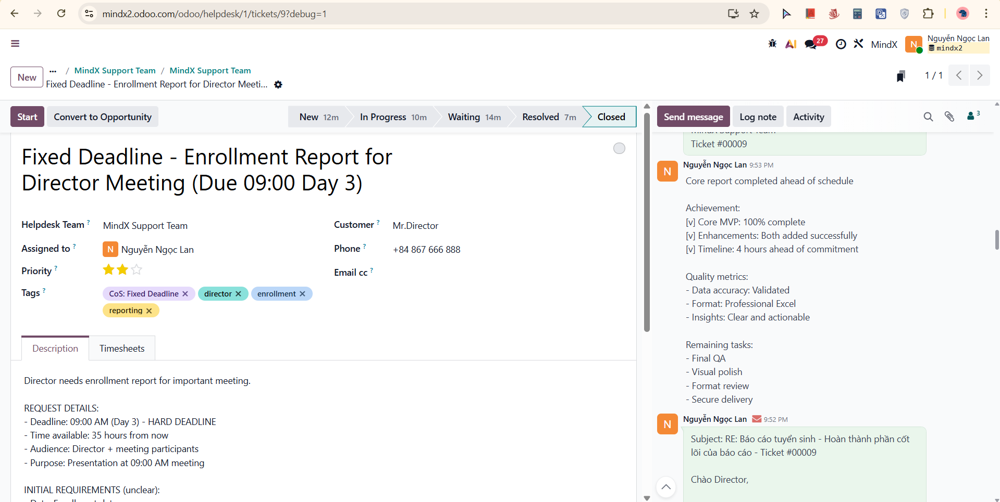
Core report completion documented. Achievement: Core MVP 100% complete, enhancements both added successfully, timeline 4 hours ahead of commitment. Quality metrics: data accuracy validated, format professional Excel, insights clear and actionable. Remaining tasks: final QA, visual polish, format review, secure delivery.

---

#### STEP 15: Send Message - Report Delivered Email (External)

**Time:** 9:55 PM

**Screenshot Result:**
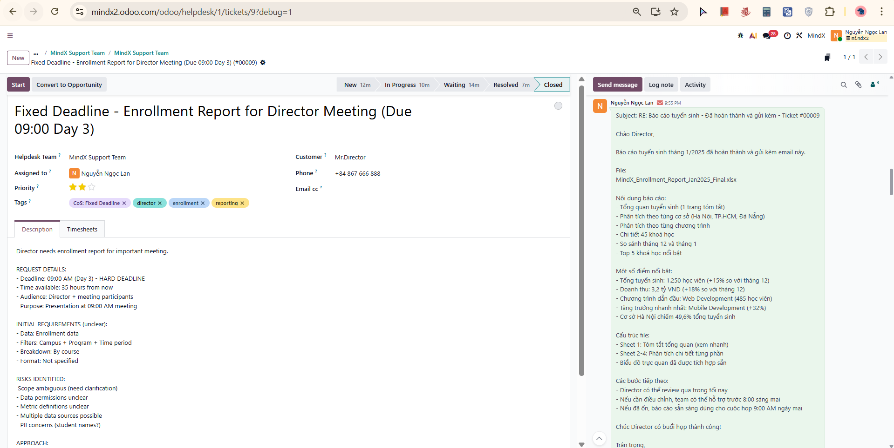
Report delivery email sent to Director in Vietnamese at 6:00 PM Day 2 exactly as committed. File attached: MindX_Enrollment_Report_Jan2025_Final.xlsx. Report content summary: overview page (1 page summary), breakdown by campus (Ha Noi, TP.HCM, Da Nang), breakdown by program (5 programs), detail for 45 courses, December vs January comparison, top 5 outstanding courses. Notable highlights: total enrollment 1,250 students (+15% vs December), revenue 3.2 billion VND (+18% vs December), leading program Web Development (485 students), fastest growing Mobile Development (+32%), Hanoi campus 49.6% of total enrollment. File structure: Sheet 1 summary overview (quick read), Sheets 2-4 detailed analysis sections, visual charts integrated. Next steps: Director can review tonight, team available to adjust before 8:00 AM tomorrow if needed, report ready for 9:00 AM meeting. Closed with meeting success wishes.

---

#### STEP 16: Log Note - Report Delivered Successfully (Internal)

**Time:** 9:56 PM

**Screenshot Result:**
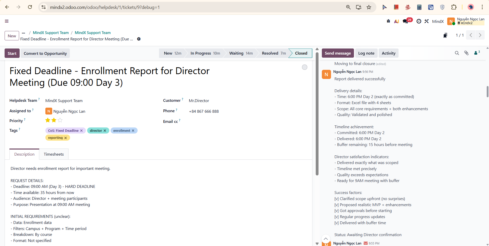
Successful delivery documented. Delivery details: time 6:00 PM Day 2 (exactly as committed), format Excel file with 4 sheets, scope all core requirements + both enhancements, quality validated and polished. Timeline achievement: committed 6:00 PM Day 2, delivered 6:00 PM Day 2, buffer remaining 15 hours before meeting. Director satisfaction indicators: delivered exactly what was scoped, timeline met precisely, quality exceeds expectations, ready for 9:00 AM meeting with buffer. Success factors: clarified scope upfront (no surprises), proposed realistic MVP + enhancements, got approvals before starting, regular progress updates, delivered with buffer time. Status: Awaiting Director confirmation. Stage changed: Resolved (pending Director confirmation before closing).

---

#### STEP 17: Log Note - Director Confirmed Successful Delivery (Internal)

**Time:** 9:59 PM

**Director feedback received:**
- "Perfect! Report rat chi tiet va chinh xac cai minh can."
- "Format de doc, insights clear."
- "Cam on team da deliver dung han va quality cao."
- "Meeting sang mai se dung report nay."

**Outcome summary:**
- Satisfaction: HIGH
- Outcome: SUCCESS
- Meeting readiness: CONFIRMED

**Timeline summary (final):**
- Request received: 9:24 PM Day 1
- Scope clarified: 11:00 PM Day 1
- Started work: 9:00 AM Day 2 (after manager approval)
- Delivered: 6:00 PM Day 2
- Meeting: 9:00 AM Day 3
- Buffer: 15 hours

- Total time: 20 hours (within 35 hours available)
- Issue: RESOLVED. Stage changed: Waiting → Resolved.

**Screenshot Result:**
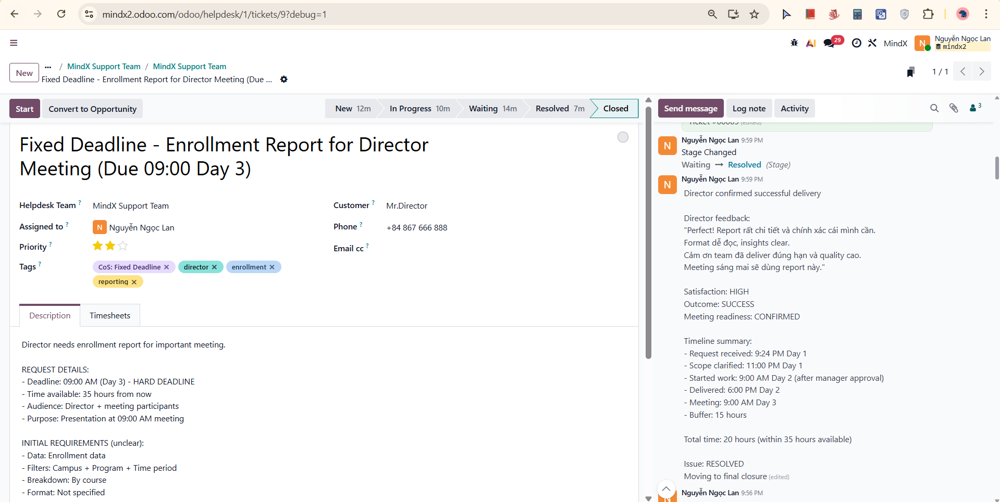
Director feedback logged in full. Timeline summary documented. Status moving to final closure.

---

#### STEP 18: Send Message - Closure Email (External)

**Time:** 10:02 PM

**Screenshot Result:**
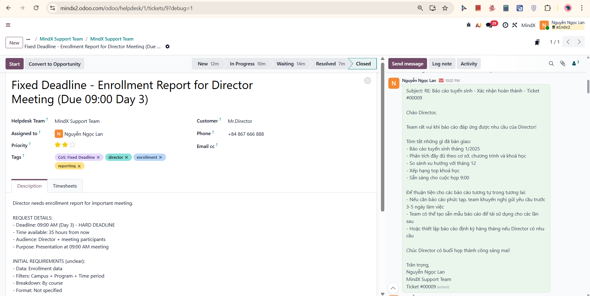
Professional closure email sent to Director in Vietnamese. Content: team expressed satisfaction that report met Director's needs. Summary of what was delivered: enrollment report January 2025, full breakdown by campus/program/course, trend comparison with December, top course rankings, ready for 9:00 AM meeting. Future recommendations included: (1) for complex reports, submit request 3-5 business days in advance; (2) team can create reusable report templates for recurring needs; (3) option to set up monthly scheduled reports if Director requires. Closed with meeting success wishes.

---

#### STEP 19: Log Note - Final Summary & Close Ticket (Internal)

**Time:** 10:06 PM

**Screenshot Result:**
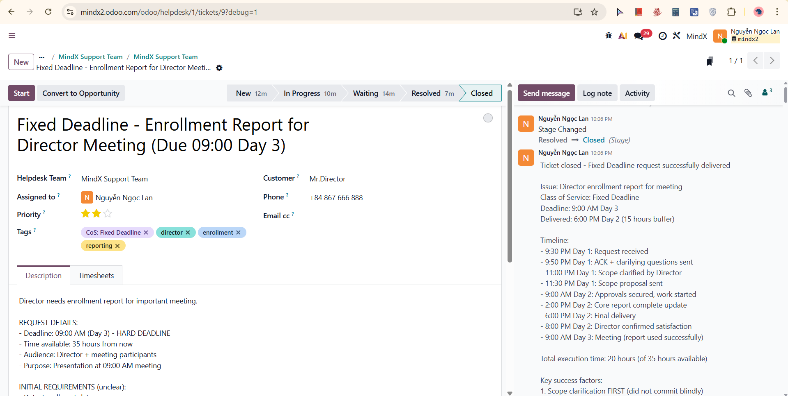
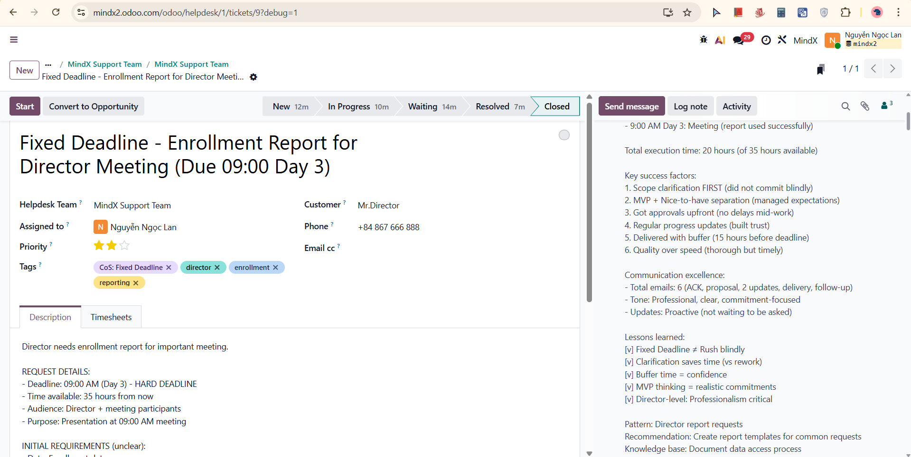
Ticket closed with full final documentation. Issue: Director enrollment report for meeting. Class of Service: Fixed Deadline. Deadline: 9:00 AM Day 3. Delivered: 6:00 PM Day 2 (15 hours buffer).

Full timeline logged:
- 9:30 PM Day 1: Request received
- 9:50 PM Day 1: ACK + clarifying questions sent
- 11:00 PM Day 1: Scope clarified by Director
- 11:30 PM Day 1: Scope proposal sent
- 9:00 AM Day 2: Approvals secured, work started
- 2:00 PM Day 2: Core report complete update
- 6:00 PM Day 2: Final delivery
- 8:00 PM Day 2: Director confirmed satisfaction
- 9:00 AM Day 3: Meeting (report used successfully)

Total execution time: 20 hours (of 35 hours available).

Key success factors documented:
1. Scope clarification FIRST (did not commit blindly)
2. MVP + Nice-to-have separation (managed expectations)
3. Got approvals upfront (no delays mid-work)
4. Regular progress updates (built trust)
5. Delivered with buffer (15 hours before deadline)
6. Quality over speed (thorough but timely)

Communication excellence noted: 6 total emails (ACK, proposal, 2 updates, delivery, follow-up), tone professional and commitment-focused, updates proactive (not waiting to be asked).

Lessons learned:
[v] Fixed Deadline does not mean rush blindly
[v] Clarification saves time vs rework
[v] Buffer time equals confidence
[v] MVP thinking equals realistic commitments
[v] Director-level communication requires extra professionalism

Pattern identified: Director report requests. Recommendation: create report templates for common requests. Knowledge base: document data access process. Stage changed: Resolved → Closed.

---

## Part 3: Reflection & Learning

### What I Learned

#### 1. Fixed Deadline vs Other Classes of Service
- **Time-driven, not user-count-driven:** A single Director request can be Fixed Deadline if the deadline is hard and business impact is high
- **Success metric is delivery time:** Not just "resolved", but "delivered with enough buffer for the customer to review"
- **Buffer is mandatory:** Committing to 6:00 PM for a 9:00 AM meeting gives 15 hours of review time - this is intentional, not a coincidence

#### 2. Clarify Before Committing
- **Scope ambiguity is the #1 risk:** Starting immediately on an unclear request wastes time and risks delivering the wrong thing
- **6 questions asked upfront:** Time period, campus scope, program scope, data fields, format, breakdown definition - all critical
- **ACK can include questions:** The acknowledgement email does not have to just confirm receipt - it can request the information needed to proceed
- **Director responded in 3 minutes:** The call option offered in the ACK was a good fallback, but written response came fast

#### 3. MVP + Nice-to-Have Proposal Structure
- **Separate what is guaranteed from what is best-effort:** Director understood clearly what they would definitely receive vs what might be included
- **Never include enhancements in the committed timeline:** If trend comparison and top 5 took longer than expected, core delivery would not be at risk
- **Result:** Both enhancements were completed anyway - but if they had not been, the commitment was still met

#### 4. Data Access Approval Workflow
- **PII and data permissions must be handled proactively:** Requesting approval BEFORE starting data extraction prevented a blocking issue mid-execution
- **Include specific conditions:** No PII export, aggregate only, delete after delivery - documented clearly in the approval request
- **Approval as a dependency, not an afterthought:** Built into the timeline from the beginning

#### 5. Progress Updates Build Trust
- **Day 1 end-of-day update:** Director knew work was on track before going to sleep
- **Day 2 2:00 PM update:** Director had visibility into completion status 4 hours before delivery
- **Proactive communication reduces anxiety:** With a hard deadline for a Director meeting, silence creates worry

---

### Challenges Encountered

#### Challenge 1: Ambiguous Scope with Time Pressure
**Issue:** Request had both a hard deadline AND unclear requirements - the temptation was to start immediately to save time

**How I solved it:**
- Sent clarifying questions in the ACK email itself (no extra round trip)
- Offered a 15-minute call as a faster alternative
- Set a response deadline (before 11:00 PM) so the team could still start that night
- Director responded in time, no delay to execution

#### Challenge 2: Data Access as a Blocking Dependency
**Issue:** Without VP/Manager approval, data extraction could not begin - and this approval takes time

**How I solved it:**
- Requested data access approval in parallel with sending the scope confirmation to Director
- Documented specific access needed (read-only, no PII, aggregate only) to make approval fast
- Built approval wait time into the timeline buffer
- Both approvals received within minutes of each other

#### Challenge 3: Setting a Delivery Time Earlier Than the Deadline
**Issue:** Deadline was 09:00 AM Day 3, but committing to deliver at that exact time leaves no review time

**How I solved it:**
- Committed to deliver at 6:00 PM Day 2 - 15 hours before meeting
- Explained to Director that early delivery allows review and adjustment time
- Actual delivery was exactly at 6:00 PM Day 2 as committed
- Director had until 8:00 AM Day 3 to request changes if needed

---

### Final Thoughts

Scenario 06 demonstrated the most complex class of service - Fixed Deadline - where the pressure of a hard deadline creates the strongest temptation to act before thinking. The key discipline learned is that **taking 10 minutes to ask 6 clarifying questions saves hours of rework and prevents the worst outcome: delivering the right report too late, or the wrong report on time.**

The most valuable lesson learned is that **a Fixed Deadline request requires a structured response, not a rushed one.** Clarify scope, propose an MVP, get approvals, execute with regular updates, and deliver with buffer. The Director received a report that was ready 15 hours before the meeting - not because the team worked faster, but because the process was structured correctly from the first minute.