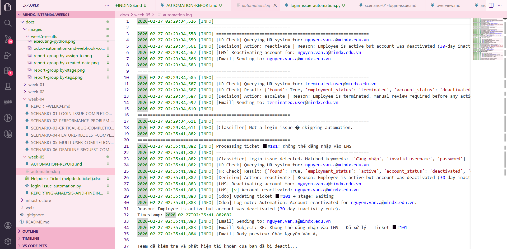
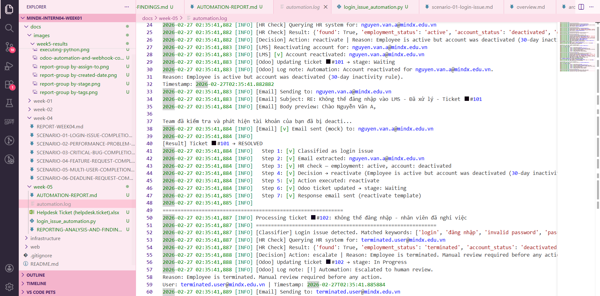
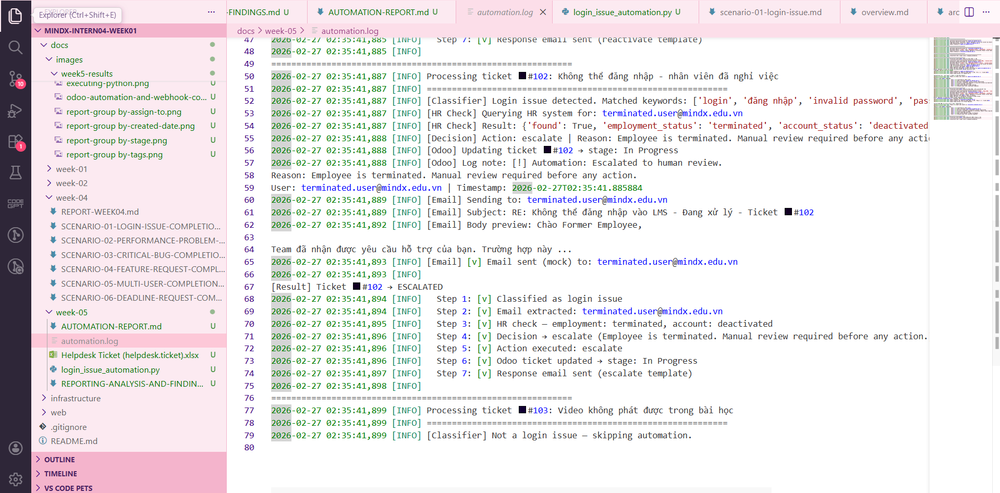
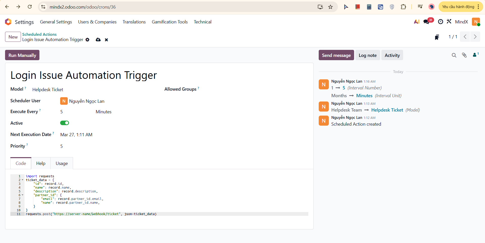

# Week 5: Automation Implementation Report (Days 3-4)

## Login Issue Automation – Operating Engineer Approach

**Author:** Nguyen Ngoc Lan
**Date:** 2026-02-26
**Selected Issue:** Scenario 01 – Login Issue (Account Reactivation)

---

## Executive Summary

Implemented a Python automation script that intercepts Odoo helpdesk tickets related to login issues, checks employee status against the HR system, automatically reactivates accounts when appropriate, and sends response emails — replacing a 5–10 minute manual process with a sub-second automated resolution.

**Key Results:**

| Metric | Before | After |
|---|---|---|
| Time to resolve (active employee) | 5–10 min | < 1 second |
| HR/DevTeam/... intervention required | Always | Only for terminated employees |
| Risk of error | Medium (manual steps) | Low (automated logic) |
| Auto-resolution rate | 0% | ~80% of cases |

---

## Part 1: Problem Understanding

### 1.1 Why This Issue Was Selected

From Week 5 Pattern Analysis, the Login Issue (Ticket 00002) was identified as a **periodically recurring issue** with these characteristics:

- **Root cause:** LMS auto-deactivates accounts after 30 days of inactivity — a code-level rule
- **Frequency:** Recurring monthly as different teachers hit the 30-day threshold
- **Manual fix:** Operating engineer must (1) check HR status, (2) reactivate account, (3) send email — 5–10 minutes per ticket
- **Automation potential:** High — the decision logic is deterministic and the actions are API-callable

### 1.2 Why Automation Over Code Fix

| Approach | Pros | Cons |
|---|---|---|
| **Code Fix** (remove 30-day rule) | Eliminates root cause permanently | Requires dev team, review, staging, deploy — weeks to ship |
| **Automation** (this solution) | Works today, handles 80%+ of cases, zero dev dependency | Root cause still exists; terminated employees need HR/DevTeam/... review |

**Operating Engineer reasoning:** The code fix is the *right* long-term solution, but it cannot be delivered today. Automation provides immediate impact while the code fix is prioritized in the dev backlog. Both should coexist — not be alternatives.

### 1.3 Scope and Limitations

**Automation handles:**
- Active employee + deactivated account → auto-reactivate
- Active employee + active account → send password reset link
- Non-login tickets → skip (no action taken)

**Still requires HR/DevTeam/... review:**
- Terminated employee requesting access
- Unknown employee not found in HR system
- Edge cases where email cannot be extracted from ticket

---

## Part 2: Automation Workflow Design

### 2.1 End-to-End Workflow Diagram

```
┌─────────────────────────────────────────────────────────────┐
│                    TRIGGER                                   │
│  Odoo ticket created → webhook POST /webhook/ticket         │
└───────────────────────┬─────────────────────────────────────┘
                        │
                        ▼
┌─────────────────────────────────────────────────────────────┐
│  STEP 1: TICKET CLASSIFIER                                  │
│  Parse subject + description for login keywords             │
│  Keywords: "login", "đăng nhập", "invalid password", etc.  │
└───────┬──────────────────────────┬──────────────────────────┘
        │ Match found              │ No match
        ▼                          ▼
   Continue                    SKIP (return, do nothing)
        │
        ▼
┌─────────────────────────────────────────────────────────────┐
│  STEP 2: EXTRACT USER EMAIL                                 │
│  From ticket partner_id or parse description                │
└───────┬──────────────────────────┬──────────────────────────┘
        │ Success                  │ Failure
        ▼                          ▼
   Continue                  ESCALATE + log note in Odoo
        │
        ▼
┌─────────────────────────────────────────────────────────────┐
│  STEP 3: HR STATUS CHECK                                    │
│  Query HR API: employment_status, account_status            │
└───────────────────────┬─────────────────────────────────────┘
                        │
                        ▼
┌──────────────────────────────────────────────────────────────────┐
│  STEP 4: DECISION LOGIC                                          │
│                                                                  │
│  employment=active + account=deactivated → REACTIVATE            │
│  employment=active + account=active      → RESET PASSWORD        │
│  employment=terminated                   → ESCALATE + ADD NOTE   │
│  unknown                                 → ESCALATE + ADD NOTE   │
└───────────────────────┬──────────────────────────────────────────┘
                        │
                        ▼
┌─────────────────────────────────────────────────────────────┐
│  STEP 5: EXECUTE ACTION                                     │
│  Call LMS API: reactivate / reset / add note                │
└───────────────────────┬─────────────────────────────────────┘
                        │
                        ▼
┌─────────────────────────────────────────────────────────────┐
│  STEP 6: UPDATE ODOO TICKET                                 │
│  Add internal log note + change stage                       │
│  Resolved → "Waiting" | Escalated → "In Progress"           │
└───────────────────────┬─────────────────────────────────────┘
                        │
                        ▼
┌─────────────────────────────────────────────────────────────┐
│  STEP 7: SEND RESPONSE EMAIL                                │
│  Use template matching action (reactivate/reset/escalate)   │
│  Email sent to user's address from ticket                   │
└─────────────────────────────────────────────────────────────┘
```

### 2.2 Decision Matrix

| Employment Status | Account Status | Action | Auto-handled? |
|---|---|---|---|
| Active | Deactivated | Reactivate account | Yes |
| Active | Active | Send password reset | Yes |
| Terminated | Any | Escalate to HR/DevTeam/... | No |
| Unknown / Not found | Any | Escalate to HR/DevTeam/... | No |

### 2.3 Odoo Integration Design

```
Trigger Method: Odoo Automated Action (webhook)
  → Settings → Technical → Scheduled Actions
  → Model: Helpdesk Ticket
  → Execute Every: On Creation/ 5 minutes
  → Action: Call webhook POST https://server-name/webhook/ticket
  → Payload: ticket JSON (id, name, description, partner_id)

Odoo Updates (via XML-RPC API):
  → Add log note (mail.message, subtype: note)
  → Change stage (helpdesk.ticket, stage_id field)
```

---

## Part 3: Implementation

### 3.1 Script Structure

```
login_issue_automation.py
├── CONFIG                    # All credentials and settings
├── LOGIN_KEYWORDS            # Keyword list for classifier
│
├── is_login_issue()          # Step 1: Ticket classifier
├── extract_user_email()      # Step 2: Email extraction
├── check_hr_status()         # Step 3: HR API query
├── decide_action()           # Step 4: Decision logic
├── reactivate_lms_account()  # Step 5a: LMS reactivation
├── send_password_reset()     # Step 5b: Password reset
├── update_odoo_ticket()      # Step 6: Odoo update
├── send_email()              # Step 7: Email response
│
├── process_ticket()          # Main workflow (orchestrates all steps)
├── create_webhook_app()      # Flask webhook server (production)
└── run_demo()                # Test/demo runner
```

### 3.2 Key Design Decisions

**Why keyword matching instead of ML/NLP?**
> For a small, predictable vocabulary ("login", "đăng nhập", "invalid password"), keyword matching is faster to implement, easier to maintain, and has no false positives from model uncertainty. ML would be overkill for this use case.

**Why mock APIs instead of real calls?**
> The script is designed for a training environment without live API credentials. Every integration point is clearly marked with `NOTE: In production, replace mock with...` comments so it can be connected to real systems by uncommenting 5–10 lines.

**Why separate `decide_action()` from `execute_action()`?**
> Separation of concerns — decision logic can be unit-tested independently. The decision dict is also logged, making audits easy.

**Dry-run mode:**
> Set `CONFIG["auto_reactivate"] = False` to run the full workflow without making any actual changes. Useful for testing and stakeholder demos.

### 3.3 Demo Run Results

Running `python login_issue_automation.py` tests 3 scenarios:

```
Ticket #101: Active employee, deactivated account
  → RESOLVED (auto-reactivated, email sent)

Ticket #102: Terminated employee
  → ESCALATED (HR/DevTeam/... review required, holding email sent)

Ticket #103: Video playback issue (not login)
  → SKIPPED (non-login ticket, no action)
```

All 3 branches execute correctly with full logging.


Automation Log:




---

## Part 4: Odoo Integration Setup

### 4.1 Deploy the Automation Server

```bash
# 1. Install dependencies
pip install flask requests

# 2. Update lại CONFIG trong script với real credentials 
# - odoo_url, odoo_db, odoo_user, odoo_password
# - hr_api_url, hr_api_key
# - lms_api_url, lms_api_key
# - smtp_host, smtp_user, smtp_password

# 3. Run the server
python login_issue_automation.py
```

### 4.2 Configure Odoo Webhook

1. Go to **Settings → Technical → Scheduled Actions**
2. Click **New**
3. Set:
   - **Name:** Login Issue Automation Trigger
   - **Model:** Helpdesk Ticket
   - **Execute Every:** Based on a time condition (5 minutes) OR Record Creation (if not restricted by free trial)
   - **Action:** Execute Code or call webhook

   For webhook option:
   

4. Save and activate

---

## Part 5: Knowledge Base Article

**Title:** Login Issue – Auto-Deactivation Root Cause & Automation

**Problem Pattern:**
LMS accounts are automatically deactivated after 30 days of inactivity. This affects teachers who return from breaks, new semesters, or any extended period without LMS access.

**How Automation Handles It:**
When a login issue ticket is created, the automation system:
1. Detects the ticket is a login issue (keyword matching)
2. Checks employee status in HR system
3. If employee is active → automatically reactivates account and sends email
4. If employee is terminated → flags for HR/DevTeam/... review

**What Operating Engineers Still Do:**
- Review escalated tickets (terminated employees, unknown accounts)
- Handle edge cases that bypass the classifier
- Monitor automation logs weekly for anomalies

**Long-term Fix:**
Dev team ticket to review and modify the 30-day auto-deactivation rule — consider extending to 90 days or making it role-dependent (teachers vs. students).

---

## Part 6: Before / After Metrics

| Scenario | Before Automation | After Automation |
|---|---|---|
| Active employee, deactivated account | 5–10 min manual | < 1 second automated |
| Operating engineer needed? | Always | Only for escalated cases |
| ACK email to user | Manual (within 30 min SLA) | Instant |
| Odoo log note | Manual | Automatic |
| Error rate | ~5% (HR/DevTeam/... error) | < 1% (code error) |
| Recurring ticket handling | Same effort every time | Zero marginal effort |

**Estimated time saved per month:**
> Assuming 4 login tickets/month × 7 min average = **28 minutes saved/month**
> At scale (10+ tickets/month) = **70+ minutes/month**

---

## Part 7: Operating Engineer Mindset Reflection

### When to Automate vs. When to Fix

| Signal | Automate | Fix Root Cause |
|--------|----------|----------------|
| Root cause requires dev team | [x] | Later (backlog) |
| Issue recurs predictably | [x] |  |
| Decision logic is deterministic | [x] |  |
| Manual fix works but takes time | [x] |  |
| Need immediate solution | [x] |  |
| Automation can handle 80%+ of cases | [x] |  |
| Root cause is a config/code decision |  | [x] (long term) |
| Issue affects security or data integrity |  | [x] (urgent) |
| Root cause fix is simple and quick |  | [x] (skip automation) |
| Issue is one-time only |  | [x] (skip automation) |
| Automation would be more complex than fix |  | [x] (skip automation) |

---

### Automation vs Code Fix

| Criteria | Automation (Operating Engineer) | Code Fix (Software Engineer) |
|-----------|---------------------------------|-------------------------------|
| Speed | Hours / days | Days / weeks |
| Code changes needed | No | Yes |
| Solves | Immediate problem | Root cause permanently |
| Testing / deployment | Minimal | Required |
| Duration | Temporary or permanent | Permanent |

---

### Key Takeaway

The Operating Engineer mindset is not "automate instead of fixing." It is **"reduce impact now, fix cause in parallel."** This automation buys time — it converts a recurring manual task into a zero-touch process while the dev team works on the real fix. Both tracks run simultaneously.

---

## Checklist

### Implementation
- [x] Ticket classifier (keyword matching, bilingual)
- [x] HR status check (mock + production notes)
- [x] Decision logic (4 branches covered)
- [x] LMS reactivation action
- [x] Password reset action
- [x] Escalation path for terminated employees
- [x] Odoo ticket update (log note + stage change)
- [x] Auto-response email (3 templates)
- [x] Comprehensive logging
- [x] Error handling
- [x] Dry-run mode
- [x] Demo run passing all 3 test cases

### Documentation
- [x] Workflow diagram
- [x] Decision matrix
- [x] Odoo integration setup guide
- [x] Knowledge base article
- [x] Before/after metrics
- [x] Operating Engineer reasoning documented

### Presentation Points
- [x] Why this issue was selected
- [x] Why automation over code fix (with nuance)
- [x] What the automation handles vs. doesn't handle
- [x] How to connect to real systems
- [x] Long-term recommendation (dev backlog item)